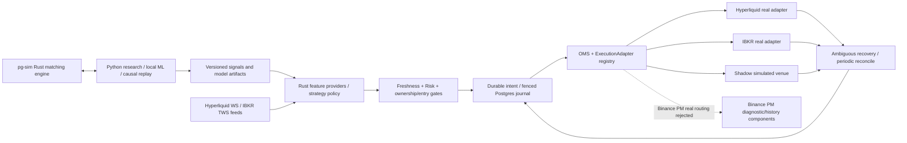

# PG-TSY Core — three-venue research and execution infrastructure

**Research proposes; Rust disposes.** An independent Python/Rust quantitative research, simulation and trading-infrastructure project for **Binance Portfolio Margin, Hyperliquid and Interactive Brokers (IBKR)**. This is not TSY Capital source code or an affiliated product. Strategies use shared feature, risk, OMS, execution, reconciliation and persistence contracts; each venue retains its own adapter and acceptance requirements.

> **Release status (2026-09-22): [`v0.1.0-rc.1`](https://github.com/xxxxxwater/pg-tsy-core-bootstrap/releases/tag/v0.1.0-rc.1) is a published, source-only Research/Shadow prerelease; unattended/live GO/NO-GO = NO-GO.** The frozen RC1 tag does **not** include post-RC1 `main` updates such as the JSONL simulator executable. Source includes a real-venue `paper/live` daemon for Hyperliquid and IBKR, but source presence and CI do not prove an accepted real-account trading chain. Binance PM's real adapter is explicitly not registered and its runtime feed is missing. Read [release readiness and exact evidence](docs/RELEASE_READINESS.md) before deployment.

## Architecture at a glance



The diagram combines source paths with their availability boundaries: shadow execution is simulated; `paper/live` **construct real Hyperliquid and IBKR adapters**, not a shadow fallback. Binance PM is a third contract/integration target, **not** a completed live runtime. For lifecycle, recovery, ownership, observability and Mermaid sequence diagrams, see [ARCHITECTURE.md](docs/ARCHITECTURE.md) and [Production closure architecture](docs/PRODUCTION_CLOSURE_ARCHITECTURE.md).

## Source-verified venue matrix

| Venue | Normalized market data in daemon | Execution/identity in source | Real daemon registration | Unresolved requirement |
| --- | --- | --- | --- | --- |
| Binance Portfolio Margin | **No runtime source**; `BINANCE_PM` feed refused | Isolated PM parsing, private WS, signed history, probe and ledger components; full execution/recovery missing | **Explicitly fails closed** | Wire feed, adapter, account-wide authenticated history/cursor/position settlement and staged tests |
| Hyperliquid | Default feature, trades/BBO/L2/candles | Official SDK, `cloid` and read-side recovery | `paper/live` constructs real adapter; paper requires Testnet | Isolated account order/fill/fees, disconnect/fault/emergency acceptance |
| IBKR | Opt-in `ibkr-marketdata` via TWS/Gateway, enabled in supplied Docker build | Community `ibapi`, `order_ref`, open/completed/execution recovery | `paper/live` constructs real adapter | **Verify paper account identity independently before using paper mode**; non-native stock reduce-only and emergency acceptance |

An adapter compiling, being registered, authenticating, accepting an order and passing end-to-end recovery are five different milestones. `paper` is **not an offline simulation**: it can send orders to the configured external account. Do not point it at a live IBKR Gateway under the assumption that `PG_LIVE_TRADING=false` prevents network trading. The default deployment uses `PG_AUTO_START=false` for live, but configuration defaults do not constitute account isolation.

## What is implemented

| Plane | Concrete components | Current limit |
| --- | --- | --- |
| Research | Python factors/ML/tuning, reproducible artifacts, causal replay and four-arm Jev challenger | Synthetic/batch PnL is not live HFT performance; Jev cannot route orders |
| Simulation | `pg-sim` deterministic order semantics, Python `RustSimClient` persistent JSONL worker and batch environment; post-RC1 `main` adds the offline Rust executable and a verified cross-language CI gate | Sim order types are not automatically available at any real exchange; the tagged RC1 did not include the binary |
| Strategy | Normalized trade/BBO/L2/candle features, registry, legacy automation and portable policy graph | Exactly one policy/legacy engine dispatches per definition; missing features fail closed |
| Risk/OMS | Freshness, entry guard, ownership, persisted stable intent, partial-fill-aware lifecycle | Need physical crash/venue evidence for end-to-end at-most-once exposure |
| Persistence/recovery | PostgreSQL lease/fencing, journal, records, ownership and reconciliation; live daemon invokes `recover_ambiguous` + `reconcile_once` periodically | Not equivalent to authenticated complete fills/fees and safe unattended operations on all three venues |
| Observability/control | Wired `/healthz`, `/readyz`, `/metrics`, reload handler; separate `pg-observability` snapshot/events crate and `pg-control` Telegram contract | `/v1/snapshot` and `/v1/events` **not wired into pg-core**; Telegram emergency end-to-end unproven; reload handler lacks auth |

## Actual mode dispatch

```text
pg-core --serve
  ├── PG_RUN_MODE=shadow ──> daemon::serve ──> in-process ShadowExecutionAdapter
  └── PG_RUN_MODE=paper/live ──> live_daemon::serve ──> real Hyperliquid/IBKR adapters
                                                          └── Binance PM: fail closed
```

`PG_RUN_MODE=live` additionally requires `PG_LIVE_TRADING=true`, startup checks and operator start; **those are software gates, not acceptance evidence**. `paper` uses real API adapters: Hyperliquid requires Testnet; IBKR's paper-account enforcement is an outstanding review item. `PG_SHADOW_FILL_MODE=rest|immediate` applies only to shadow. Never send real credentials through Actions or publish a credential in documentation.

## Repository map

```text
research/                    Python research, batch environment, replay, challenger
rust/crates/pg-sim/           Rust simulation JSONL kernel
rust/crates/pg-marketdata/    Normalized feeds, freshness, supervision
rust/crates/pg-strategy/      Registry, policy engine, features
rust/crates/pg-risk/          Exposure and order gates
rust/crates/pg-oms/           Order state machine
rust/crates/pg-execution/     ExecutionAdapter, shadow and composition
rust/crates/pg-orchestrator/  Durable dispatch, recovery and reconciliation
rust/crates/pg-store/         PostgreSQL durable state, lease/fencing and fill ledger
rust/crates/pg-observability/ Snapshot/events component (not linked into pg-core)
rust/crates/pg-control/       Telegram contracts (full daemon hookup unverified)
rust/crates/pg-core/          CLI, shadow daemon, paper/live daemon, HTTP health
rust/adapters/               pg-binance, pg-hyperliquid, pg-ibkr
strategies/ contracts/       Strategy definitions and versioned contracts
.github/workflows/           Rust/Python/venue/Compose/Postgres CI and isolated simulator bridge
infra/ docker-compose*.yml   Deployment templates, NOT deployment evidence
```

## Local non-trading verification

```bash
cd rust
cargo fmt --check
cargo clippy --workspace --all-targets -- -D warnings
cargo test --workspace
cargo metadata --locked --format-version 1 >/dev/null
cargo test -p pg-binance --all-targets
cargo test -p pg-hyperliquid --features sdk
cargo test -p pg-ibkr --features sdk
cargo clippy -p pg-core --all-targets --features ibkr-marketdata -- -D warnings
cargo build --locked --release -p pg-sim --bin pg-sim
cd ../research
pip install -e '.[dev]'
ruff check .
pytest -q
export PG_SIM_BINARY="$(pwd)/../rust/target/release/pg-sim"
python -m pytest -q tests/test_sim_binary.py -ra
```

The dedicated PostgreSQL Actions job uses an isolated PostgreSQL service for fill/settlement/fencing tests. Review [CI](.github/workflows/ci.yml), [PostgreSQL workflow](.github/workflows/postgres-fill-ledger.yml), [simulator bridge CI](.github/workflows/pg-sim-bridge.yml) and actual per-commit Actions results; these commands/tests do **not** submit live orders or certify real-exchange access. Do not run `paper/live` as a generic smoke test. `docker compose config` checks syntax, not container startup or account safety.

## Release policy and documentation

The first GitHub release, [`v0.1.0-rc.1`](https://github.com/xxxxxwater/pg-tsy-core-bootstrap/releases/tag/v0.1.0-rc.1), **was published on 2026-09-22 as a source-only Research/Shadow prerelease**. Its tagged code predates the current `main` simulator executable and engineering handbooks; updating `main` does not silently alter the published RC1 source archive or create a new release. Paper/live require independent exchange-specific signoff and must not be bundled into a purported production v1 just because code has been merged. Never turn CI green into a live-trading switch or silently clear `SAFE_HOLD`.

| Document | Purpose |
| --- | --- |
| [Architecture](docs/ARCHITECTURE.md) | End-to-end component, runtime, order and recovery diagrams |
| [Engineering automation](docs/ENGINEERING_AUTOMATION.md) | Engineering ownership, full CI quality gates, commands, exact-SHA evidence, change review and rollback |
| [Production closure architecture](docs/PRODUCTION_CLOSURE_ARCHITECTURE.md) | Detailed three-venue topology, durable order sequence, atomic ledger, SAFE_HOLD, emergency exit and fault matrix |
| [Simulator JSONL protocol](docs/SIM_JSONL_PROTOCOL.md) | Python/Rust subprocess contract, Decimal and request identity, examples and integration acceptance |
| [Exchange adapters](docs/EXCHANGES.md) | Venue-specific feed, identity, routing and safety differences |
| [Production runtime](docs/PRODUCTION_RUNTIME.md) | Explicit run-mode semantics, startup gates, controls, operational caveats |
| [Status](docs/STATUS.md) | Current implemented-vs-missing matrix |
| [Release readiness](docs/RELEASE_READINESS.md) | Actual merge audit, CI evidence, release checklist and blockers |
| [Strategies](docs/STRATEGIES.md) / [Hybrid simulation](docs/HYBRID_SIM_RL.md) | Policy definitions and simulator contracts |
| [Binance PM isolated diagnostics](docs/PM_ISOLATED_READ_ONLY_EVIDENCE.md) | Venue-specific opt-in diagnostic prerequisites; not a project-wide requirement |

The existing Binance PM/Freqtrade production bot and manual positions are **out of scope**. Documentation and CI changes must not alter, migrate or stop that service. `main` is an integration branch; inspect actual merge diff and preserve source branch history until semantic parity is proven. A documentation commit is not a test run, container image, tag or GitHub Release.
