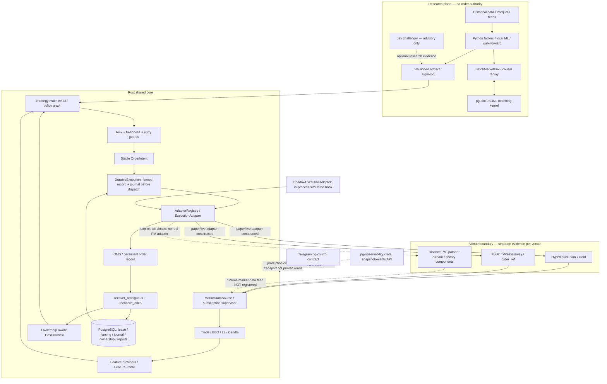
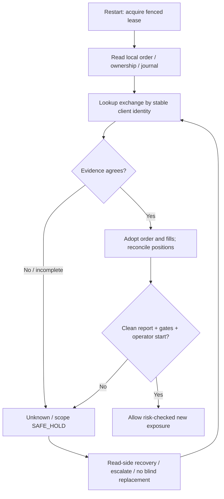

# PG-TSY Core architecture — source-verified snapshot (2026-09-22)

> Scope: repository architecture and **observed source wiring**, not proof of live-exchange acceptance. The three supported *design targets* are Binance Portfolio Margin (`BINANCE_PM`), Hyperliquid and Interactive Brokers (`IBKR`). Status can differ by venue and by capability. Start with [STATUS](STATUS.md), [EXCHANGES](EXCHANGES.md) and [RELEASE_READINESS](RELEASE_READINESS.md) before claiming a release.

## 1. Architectural principles

- **Research proposes; Rust disposes.** Python research, ML, causal replay and the optional Jev challenger emit versioned signals/artifacts; only Rust strategy -> risk -> durable execution may submit an intent.
- **One shared contract, three independently proven venue boundaries.** `AssetKey` carries venue+asset; normalized data and `ExecutionAdapter` are shared, but client identity, market data, native reduce-only, authentication and history are venue-specific.
- **Do not conflate compile, register, connect, reconcile and release.** An SDK crate or passing test is not a working deployment or production acceptance.
- **Unknown is not rejected.** Ambiguous order outcomes stay held until venue truth and durable ownership agree; manual/unknown positions must not be silently adopted.
- **A diagnostic, simulated matching engine, observability HTTP endpoint or model cannot clear SAFE_HOLD.** Human approval and real-venue evidence remain separate gates.

## 2. System topology (as implemented versus target)



The shadow path uses an in-process simulated execution adapter even when market-data sources are real. In `paper`/`live`, `main.rs` routes to `live_daemon::serve`, which constructs **real** venue adapters and does not fall back to shadow. The Binance PM registration branch explicitly errors. The diagram's dashed edges are missing or unverified integrations, **not runtime guarantees**.

## 3. Source layout and authority

| Location | Responsibility | Verified boundary |
| --- | --- | --- |
| `research/` | Python research, factors, tuning, batch environment, causal replay, challenger | No direct live order path |
| `rust/crates/pg-sim` | Deterministic matching semantics and JSONL worker | Simulator behavior does not imply venue order-type support |
| `rust/crates/pg-marketdata` | Common event schema, feeds/freshness, subscription supervision | Binance PM live feed not wired |
| `rust/crates/pg-strategy` | Legacy automation, portable feature/policy rules, instance registry | One decision engine dispatches per definition; missing features fail closed |
| `rust/crates/pg-risk`, `pg-oms`, `pg-execution` | Order gates, lifecycle, common adapter and simulated execution | External exactly-once is not established |
| `rust/crates/pg-orchestrator`, `pg-reconcile`, `pg-store` | Durable dispatch, venue truth checks, persistence, ownership, lease/fencing | Recovery needs venue-level end-to-end fault proof |
| `rust/adapters/pg-hyperliquid` | Official SDK-bound feeds/execution, `cloid` lookup | Account-verified deployment not evidenced by source alone |
| `rust/adapters/pg-ibkr` | Community `ibapi` TWS/IB Gateway feed/execution, `order_ref` recovery | Stock reduce-only is software-only if explicitly enabled |
| `rust/adapters/pg-binance` | PM parsing/WS/history/isolated probes/ledger-related interfaces | No real PM runtime routing or full account cursor/position settlement |
| `rust/crates/pg-core/src/{main,daemon,live_daemon}.rs` | Mode dispatch and daemon runtime | `shadow` uses `daemon`; `paper/live` use `live_daemon` |
| `rust/crates/pg-observability` | `runtime.snapshot.v1` and events component | Present in workspace **but absent from pg-core dependencies and health routes**; do not advertise as running daemon endpoint |
| `rust/crates/pg-control` | Telegram control contracts/feature | Full real daemon control/emergency flow not accepted |

## 4. Mode and venue capability matrix

| Runtime mode | Execution construction | Network/side-effect meaning | Release interpretation |
| --- | --- | --- | --- |
| `shadow` | `ShadowExecutionAdapter` for all three venues | Can use real Hyperliquid/IBKR market feeds; execution is simulated. Binance-derived feed is rejected. | Suitable target for research/shadow validation, not full three-venue runtime parity |
| `paper` | `live_daemon` + real Hyperliquid/IBKR adapters | **Not offline simulation**: adapters submit venue requests. Hyperliquid explicitly requires Testnet. IBKR configuration has not been proven in code to enforce a paper account/TWS session. | BLOCK actual order-run until isolation is independently proved |
| `live` | `live_daemon` + real Hyperliquid/IBKR adapters | Requires `PG_LIVE_TRADING=true`, startup gates, operator start and risk; calls real venues. Binance PM explicitly rejected. | BLOCK unattended/live release pending acceptance |

`RunConfig::routes_to_real_venue()` is true only for `live` with the deliberate key, **but that method does not establish that `paper` is side-effect-free**. Paper invokes `build_real_adapter_registry` too. Treat any paper connection as capable of external orders until the destination account/network is verified.

## 5. Feed and decision lifecycle

```mermaid
sequenceDiagram
  participant X as Hyperliquid WS / IBKR TWS
  participant F as SubscriptionSupervisor
  participant S as StrategyRegistry / PolicyEngine
  participant R as Risk + EntryGuard
  participant D as DurableExecution
  participant P as PostgreSQL
  participant E as Venue adapter (or shadow)
  X->>F: Trade/BBO/L2/Candle event
  F->>S: normalized event + freshness
  S->>S: factors + PositionView; one decision path
  S->>R: OrderIntent (increase or reduce-only)
  R-->>S: reject/SAFE_HOLD when unsafe
  R->>D: approved intent
  D->>P: assert lease; save OrderRecord
  D->>P: append intent + dispatch-started journal
  D->>P: assert fencing again
  D->>E: submit with stable identity
  alt ACK
    E-->>D: venue order identity
    D->>P: record ACK / journal
  else Reject
    E-->>D: explicit reject
    D->>P: record rejection
  else Timeout / ambiguous
    E-->>D: Unknown or transport error
    D->>P: retain intent/unknown for recovery
  end
  loop periodic in live_daemon (default 2000ms)
    D->>E: recover_ambiguous then snapshot/reconcile
    E-->>D: open/orders/positions truth
    D->>P: validated state + report under fencing
    D-->>R: block exposure if unclean
  end
```

This is a **code-path diagram**, not a claim that every venue implements a fully verified history/fee/position settlement. Shadow OMS fill persistence and Binance account-wide signed-history atomicity need separate verification. `live_daemon` derives a basic position view from strategy quantity; its average entry, filled-entry count and unrealized/peak returns are `None`/zero in `position_view()`, so a live policy depending on those fields must not be described as fully supported.

## 6. Restart, idempotency and ownership



Hyperliquid maps intent UUID to `cloid`. IBKR maps `client_order_id()` to `order_ref`, searching open, completed and execution reports. Binance PM needs authenticated history/cursor/ownership reconciliation before registration. The lease/fencing token guards **local durable writes**; it is not an exchange-enforced fencing token. Never treat a missing immediate lookup after a lost ACK as permission to post again. Manual and unresolved holdings are distinct from strategy-owned positions; shutdown/emergency logic may only act on proven owned exposure.

## 7. Observability and operator plane (actual wiring)

`pg-core`'s currently wired HTTP listener in `health.rs` serves `/healthz`, `/readyz`, `/metrics` and `POST /admin/reload`; the last endpoint is not authenticated in that handler. Production Compose maps port 8080 to loopback, but the handler defaults to binding `0.0.0.0:8080`; operators must not expose it publicly. The separately merged `pg-observability` crate implements `/v1/snapshot` and `/v1/events`, but `pg-core/Cargo.toml` does not depend on it and `health.rs` does not register these routes. [OBSERVABILITY](OBSERVABILITY.md) describes that component's contract, **not a confirmed deployed endpoint**. Telegram's command contract does not itself prove `/emergency_exit` is wired and accepted end-to-end.

## 8. Acceptance and non-goals

Passing Cargo/Python/isolated PostgreSQL CI supports *source/test quality only*. Before a tagged product release, assess [RELEASE_READINESS](RELEASE_READINESS.md) and check the final exact commit's CI. Before any money-routing release, independently demonstrate segregated accounts (including IBKR paper mode), authenticated reads/order lifecycle, complete fill/fee/position reconciliation, missing-ACK, restart, `kill -9`, stale fencing, database loss, cancel/partial-fill races, audited emergency reduce-only and operator approval for **each venue**. Preserve the existing Binance PM/Freqtrade production service and all manually owned positions; this repository's CI and documentation may not change them.
