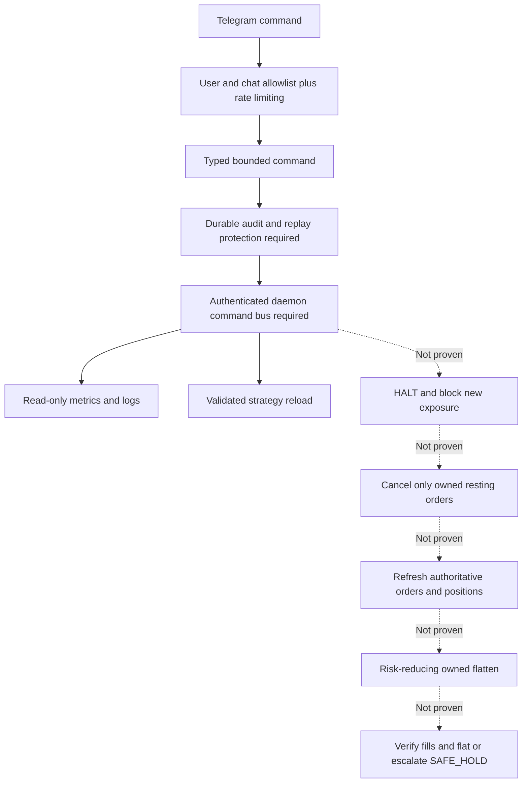

# Operator control plane — implemented HTTP vs target Telegram contract (2026-09-22)

**Contract is not deployment.** `pg-control` contains Telegram/operator command definitions and an opt-in compile path. The reviewed `pg-core` daemon only wires an HTTP reload command; Telegram `/emergency_exit` -> authoritative cancel -> strategy-owned reduce-only flatten -> confirmed flat -> HALT remains **unverified end to end**. Do not assume an active remote kill switch or authorize real capital on this basis. See [ARCHITECTURE](ARCHITECTURE.md), [PRODUCTION_RUNTIME](PRODUCTION_RUNTIME.md), [RELEASE_READINESS](RELEASE_READINESS.md) and [HTTP admin authentication](ADMIN_RELOAD_SECURITY.md).

## Command capability matrix

| Interface | Target semantics | Runtime evidence |
| --- | --- | --- |
| HTTP `POST /admin/reload` | Validate and reload strategy definitions | Enqueues only `ReloadStrategies`; now denies absent/invalid token by default; isolated auth/dispatch tests in `health.rs` |
| Telegram `/start` | Resume only after authenticated operator approval and reconciled risk/ownership/lease | Transport-to-real-daemon admission not proven |
| Telegram `/status`, `/logs [n]`, `/latency`, `/performance` | Bounded authenticated audit and exchange-derived status, fees, latency and PnL | Full end-to-end binding and exchange-authoritative metrics not proven |
| Telegram `/scripts`, `/reload_script <name>` | List and safely reload allowlisted definitions | Telegram-to-daemon binding not proven; separate HTTP reload exists |
| Telegram `/emergency_exit` | HALT, cancel *only owned orders*, refresh truth, venue-appropriate risk reduction, verify fills and flat state or escalate SAFE_HOLD | **BLOCKING: no complete real-venue acceptance evidence** |

## Trust and execution boundary

Telegram must never become a privileged shell, arbitrary file loader, or direct bypass of Risk -> OMS -> ExecutionAdapter -> journal. Unknown or manually owned positions cannot be flattened as strategy positions; IBKR stock orders lack native atomic reduce-only protection, making race evidence essential.

## Implemented HTTP surface and authorization

`pg-core/src/health.rs` serves `/healthz`, `/readyz`, `/metrics` and `POST /admin/reload`. This release hardening adds `PG_ADMIN_TOKEN`: absent/invalid secret returns **403**, incorrect/missing/duplicate Bearer authorization returns **401**, valid token may enqueue only reload. The secret must be 32–512 printable ASCII characters. Tests verify the control channel receives **nothing** for denied requests and one typed reload command for authorized requests. The listener still defaults to `0.0.0.0:8080`; production Compose exposes host port on `127.0.0.1`, but administrators must still restrict Docker networks, protect secrets and avoid plaintext access across untrusted networks. Compose does not forward the token by default, so reload remains disabled until explicitly configured. See the [security runbook](ADMIN_RELOAD_SECURITY.md) for exact limits, installation and verification.

The separately merged `pg-observability` snapshot/events library is **not mounted into `pg-core`**; `/v1/snapshot` and `/v1/events` cannot be advertised as live routes. An absent endpoint or stale status means `UNKNOWN`, never success.

## Acceptance before unattended or remotely operated release

- [ ] Verify audited, granular, authenticated Telegram-to-daemon transport; deny-by-default identities, command TTL/nonces, idempotency, replay prevention, rate limits and secret hygiene.
- [ ] Show start/reload cannot bypass manual operator approval, live mode gate, fencing, reconciled positions, ownership, stale data or unresolved orders.
- [ ] Show emergency HALT-first admission, owned-only cancellation and venue-appropriate reduction, including partial fills, cancel races, lost ACK, DB/lease loss and restart.
- [ ] Persist incident + SAFE_HOLD and escalate unverified flatten rather than claiming success after send/ACK.
- [ ] Test disconnected and duplicate Telegram callbacks plus real segregated paper/testnet acceptance for each venue before live canary.

This branch changes the HTTP admin boundary only. It neither fixes the unproven Telegram emergency path nor touches existing Binance PM/Freqtrade live services or manual positions.
