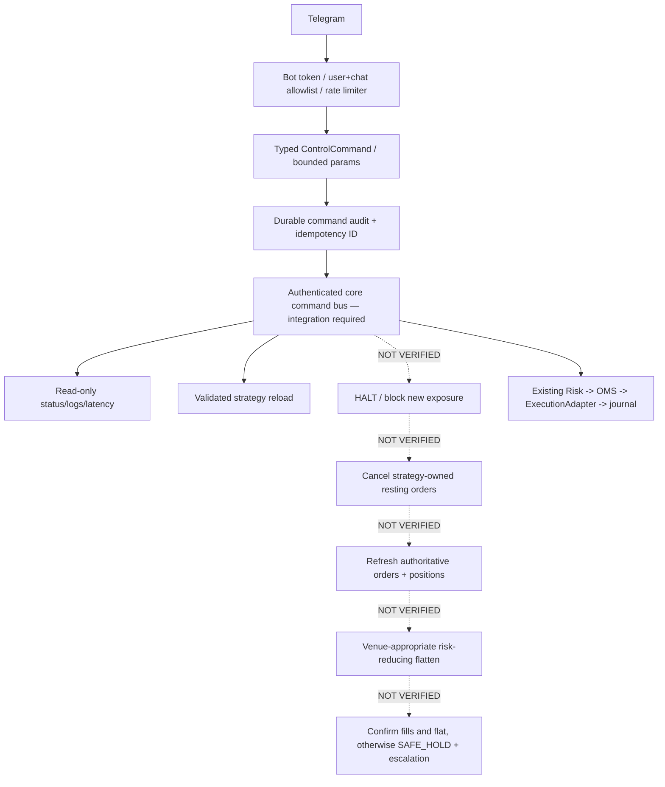

# Operator control plane — source and release boundaries (2026-09-22)

**Contract is not deployment.** The Rust `pg-control` crate contains Telegram/operator command definitions and an opt-in Telegram compilation path, but the reviewed `pg-core` executable's wired HTTP operator command is currently only `POST /admin/reload`. The Telegram `/emergency_exit` -> real-venue cancel -> owned reduce-only flatten -> verified completion -> HALT flow is **not accepted end to end**. Do not claim a working remote kill switch or place real capital on the assumption it is available. See [ARCHITECTURE](ARCHITECTURE.md), [PRODUCTION_RUNTIME](PRODUCTION_RUNTIME.md) and [RELEASE_READINESS](RELEASE_READINESS.md).

## 1. Target command contracts

| Telegram command | Intended semantics | Acceptance status in running real daemon |
| --- | --- | --- |
| `/start` | Request start/resume after authenticated startup/reconcile/risk/ownership gates | Transport-to-real-daemon admission not proven |
| `/performance` | Show exchange-authenticated PnL and fees | Authenticated cross-venue metrics not proven |
| `/status` | Venue, strategy, risk, unknown orders, SAFE_HOLD, lease evidence | Full Telegram-to-daemon binding not proven |
| `/logs [n]` | Bounded structured log tail without secrets | Transport-to-daemon not proven |
| `/emergency_exit` | Audited HALT -> cancel only owned orders -> refresh venue truth -> venue-appropriate reduce-only flatten -> confirm fills/flat state, escalate ambiguities | **BLOCKING: not verified end to end** |
| `/scripts` | List allowlisted definitions | Transport-to-daemon not proven |
| `/reload_script <name>` | Validate and reload an allowlisted strategy | Telegram-to-daemon not proven; HTTP reload exists separately |
| `/latency` | Show timestamped feed/OMS/venue order latency | Full real metrics not proven |

The list is the **target interface**, not a claim that every command works in the compiled/executed service. Never convert a shell string, arbitrary file path or chat message into a venue request.

## 2. Trust boundary and architecture

A Telegram relay is neither a privileged shell nor an owner of trading state. Missing authoritative data, unknown order outcome or partial/emergency fills must block new exposure and retain an incident audit. Manual or unknown positions must never be flattened as if they were strategy-owned. IBKR ordinary equities do not provide a native atomic reduce-only primitive in the current adapter; their software check requires separate race-proofing.

## 3. Implemented HTTP surface and security

The running `pg-core/src/health.rs` offers `/healthz`, `/readyz`, `/metrics` and `POST /admin/reload` (enqueue reload only). The reload handler has **no authentication** in source and the listener defaults to `0.0.0.0:8080`. Production Compose maps the host port to `127.0.0.1`, but direct hosts must explicitly restrict interfaces/firewall. No UI or unauthenticated HTTP route may toggle `PG_LIVE_TRADING`, clear SAFE_HOLD or submit/cancel orders directly.

The separately merged `pg-observability` snapshot/events library is not currently mounted into `pg-core`; refer to [OBSERVABILITY](OBSERVABILITY.md). An absent endpoint or stale status must display `UNKNOWN`, not success.

## 4. Acceptance before remotely operated or unattended release

- [ ] Bind Telegram transport to a strongly authenticated daemon command bus; verify deny-by-default user/chat allowlists, TTL/nonces, audit, rate limits, replay resistance and no secrets in logs.
- [ ] Demonstrate `/start` cannot bypass operator approval, live key, lease/fencing, authenticated account/ownership reads, stale feed or unresolved orders.
- [ ] Demonstrate `/emergency_exit` is idempotent, atomic in admission (HALT first) and only cancels/flatttens *proven* strategy-owned positions, including partial fill, cancel race, lost ACK, unknown/manual positions and cross-venue differences.
- [ ] On failure, persist incident and SAFE_HOLD and escalate rather than claiming flat because a cancel or submit request was accepted.
- [ ] Inject lost Telegram connection, duplicate callbacks, process restart, lease loss, database outage and exchange outage; obtain real paper/testnet evidence for each venue before any live canary.

`PG_LIVE_TRADING` and production credentials may not be injected by Telegram or GitHub Actions. This repository release process does not modify the existing Binance PM/Freqtrade bot or manually owned exposure.
