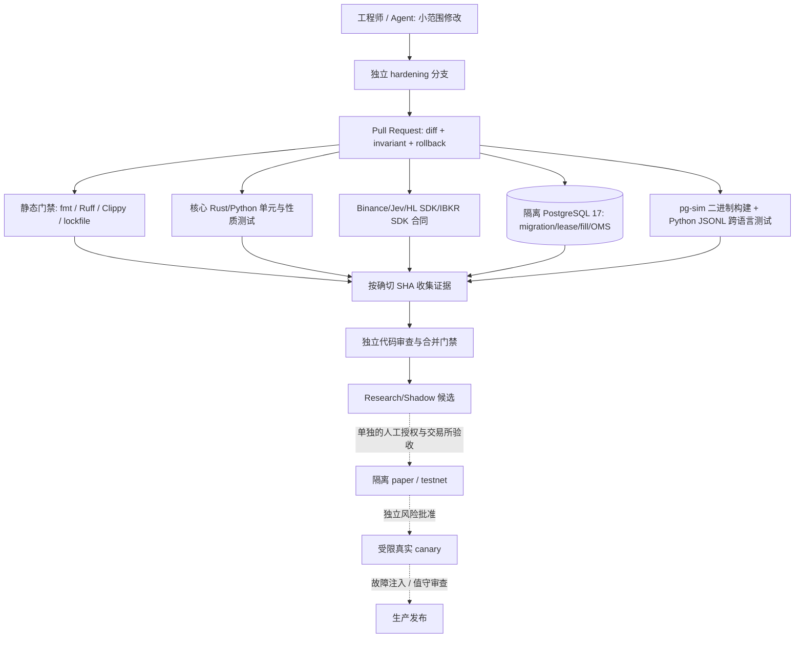
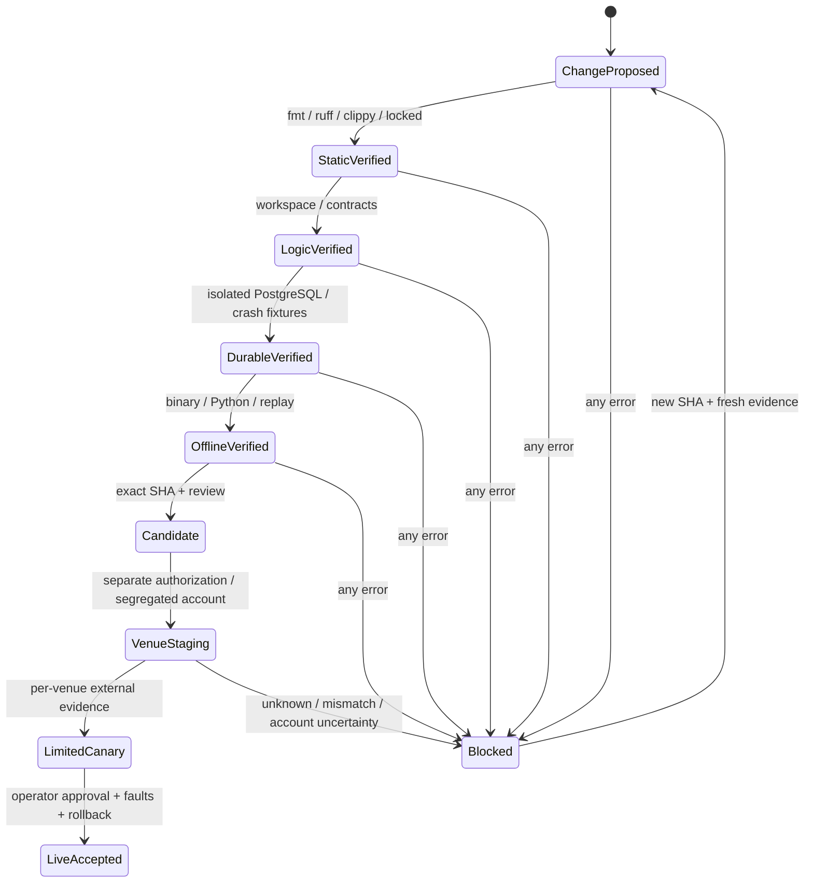

# PG-TSY 工程自动化与质量门禁手册

> 版本：2026-09-22，适用于 `hardening/post-rc1-production-closure` 的代码修复评审。**这是一份源码和 CI 操作手册，不是实盘授权。** `v0.1.0-rc.1` 是已冻结的 Research/Shadow 源码预发布，后续修复不应改写该 Tag。本文禁止 CI 触碰真实账户、执行实盘订单、推送到生产服务器或自动解除 SAFE_HOLD。
>
> 必读：[ARCHITECTURE](ARCHITECTURE.md)、[EXCHANGES](EXCHANGES.md)、[RELEASE_READINESS](RELEASE_READINESS.md)、[OPERATIONS](OPERATIONS.md)、[STORAGE_RECOVERY](STORAGE_RECOVERY.md) 与 [工程闭环架构](PRODUCTION_CLOSURE_ARCHITECTURE.md)。每个功能应引用确切源码、测试、CI run ID、SHA；没有证据就标记 `未验证`。

## 1. 工程范围、权威与不可越界规则

这是 Python 研究 + Rust 确定性执行的量化基础设施单仓：`research/` 进行特征、离线模型、模拟、统计检验；`rust/crates/` 承担市场事件、策略、风控、OMS、持久化、恢复、可观测性、控制平面；`rust/adapters/` 隔离 Binance PM、Hyperliquid、IBKR。**模型输出、CI 成功、文档更新不拥有下单权限。** 独立的 Binance PM/Freqtrade 生产机器人、手工仓位、真实交易账户和服务器不在本轮自动化操作范围。

| 权威 | 唯一作用 | 明确不允许 |
| --- | --- | --- |
| Git 工作流 | 代码审查、分支和历史、静态契约 | 通过 push 改变账户配置、偷偷移动发布 Tag |
| CI | 无密钥构建、模拟器和 DB 隔离测试、回归证据 | 注入交易 Key、修改真实数据库、宣告交易所认证已验收 |
| Python 研究 | 数据集/因子/候选信号/离线实验 | 绕开 Rust 风控调用交易所 SDK |
| Rust 交易核心 | 经过 lease/fencing、风控、OMS/Journal 的订单路径 | 在异常结果未知时盲目重发或接管人工仓位 |
| 运维人员 | 独立账户、额度、网络、签名审批、变更窗口 | 将 GitHub Actions `success` 当成开仓许可 |

## 2. 可复核的自动化拓扑



虚线是未来**必须单独获取的证据**，不是任何自动工作流的部署动作。当前 `main` 分支保护未启用：CI 和本手册不能替代强制 code review / required checks 配置。只在项目管理员确认权限、规则和异常恢复后设置分支保护。

## 3. 仓库所有权与变更边界

| 目录 / 文件 | 变更时必检 | 兼容性和回滚责任 |
| --- | --- | --- |
| `rust/crates/pg-types`、`contracts/` | 版本化 serde、venue/asset/client ID、下游 replay | 变更公共字段必须兼容既有日志、数据和适配器 |
| `pg-marketdata`、`pg-strategy`、`strategies/` | 数据时间戳、缺口/新鲜度、缺失因子拒绝、双决策引擎互斥 | 防止冷启动缺值导致错误开仓 |
| `pg-risk`、`pg-oms`、`pg-execution` | reduce-only、数量/价格、终态、幂等 | 替换交易控制必须附状态机回归 |
| `pg-orchestrator`、`pg-reconcile`、`pg-store` | journal-before-dispatch、租约 fencing、混合订单/成交/持仓和故障注入 | 禁止用 remote snapshot 先覆盖本地再比较；保留原始差异证据 |
| `adapters/pg-{binance,hyperliquid,ibkr}` | 每个 venue 独立身份、订单类型、余额/费率/成交历史 | SDK 合同测试不等于 API 账户验收 |
| `pg-core` / `docker-compose.production.yml` | mode、账户、配置、真实路由、健康/控制端口 | `paper` 可能调用真实适配器；需隔离证明 |
| `pg-sim` / `research/src/pg_tsy/sim` | JSONL schema、Decimal、Python 桥接、独立进程状态 | 不能让模拟成交伪装成实际成交 |
| `.github/workflows/` | 触发器、最小权限、无 Key、失败即停止 | 不允许新增默认自动实盘部署 |
| `docs/` | 与同提交的实际能力、命令和 CI 一致 | 状态更新要保留已知缺陷与不可用路径 |

每个 PR 说明包含：问题和实际危害、修改文件、前后不变量、失败模式、测试命令和 CI 链接、数据/兼容性影响、回滚方案、是否需要独立人工实盘验收。高风险 PR 必须同时让审查者读交易所合同和数据库变更，而不是只读主程序。

## 4. 当前自动检查：准确到 workflow / step

| Workflow | 触发与实际检查 | 它**不能**证明 |
| --- | --- | --- |
| `.github/workflows/ci.yml` | push / PR；Python `ruff check .` 和 `pytest -q`；Rust `cargo fmt --check`、workspace Clippy `-D warnings`、workspace tests、`cargo metadata --locked`；Binance marketdata/adapter tests、Jev 合同、HL/IBKR `sdk` 测试/Clippy、`pg-core --features ibkr-marketdata` Clippy、Telegram feature compile；Compose service/profile/配置语法 | 真实账户已授权、容器已启动、成交/手续费已落库、实盘可无人值守 |
| `.github/workflows/postgres-fill-ledger.yml` | 启动临时 PostgreSQL 17，真实 schema migration、订单/成交 ledger、冲突/去重、fencing、失 ACK 不双 POST、严格 Clippy | 交易所 REST/WS 最终真相和跨机器网络分区验收 |
| `.github/workflows/binance-public-live.yml` | 公共市场源的无密钥测试（以 workflow 代码和运行记录为准） | Binance PM 私有账户读写、资产权限和生产适配 |
| `.github/workflows/publish-v0.1.0-rc.1-once.yml` | 历史的一次性 RC1 发布流水线，固定 SHA、检查 CI、源码 Release build 和离线 replay，发布 GitHub 预发布 | 后续 commits 的质量、实际 daemon/交易所已部署 |
| `.github/workflows/repair-hardening-once.yml` | **仅本修复分支**且 workflow 文件变动时启动：依赖同步、fmt/Ruff、pg-sim 构建、跨语言协议测试，成功后只向修复分支写回检查过的 lockfile/格式 | 常驻发布门禁或可以直接合入 main。此工作流是一次性修复工具，不应重复复制到生产发布配置。 |

CI 结论必须关联完整 `head_sha`：在 GitHub Actions 看 workflow 和各 job `status=completed`、`conclusion=success`，不接受“其中一个 job 成功”、父提交成功、`in_progress`、被跳过的必选检查或被 `|| true` 吞掉的错误。GitHub workflow 后续由机器人提交格式/lockfile，原 run 的绿色只涵盖它测试的旧 checkout：**必须重新确认机器人新提交 SHA 的完整 CI。**

## 5. 研发命令：无网络交易执行的安全验证

从仓库根执行，Rust 的 Cargo workspace 在 `rust/` 而不在仓库根：

```bash
cd rust
cargo metadata --locked --format-version 1 >/dev/null
cargo fmt --check
cargo clippy --workspace --all-targets -- -D warnings
cargo test --workspace
cargo test -p pg-binance --all-targets
cargo test -p pg-hyperliquid --features sdk
cargo test -p pg-ibkr --features sdk
cargo clippy -p pg-core --all-targets --features ibkr-marketdata -- -D warnings
cargo check -p pg-control --features telegram
```

Python 单独运行：

```bash
cd research
python -m pip install -e '.[dev]'
ruff check .
python -m pytest -q
```

测试前不导出 `PG_LIVE_TRADING=true`；不使用真实交易所私钥。`cargo test --workspace` 会包含 `pg-sim` Rust library/binary tests，但 **不会自动生成 Python 预期的 release 二进制**，Python-only workflow 无 Rust build 时可以跳过 `test_sim_binary.py`。真正的跨语言验收必须另用以下独立流程，且其测试不得 skip：

```bash
cd rust
cargo build --locked --release -p pg-sim --bin pg-sim
cargo test --locked -p pg-sim --all-targets
cargo clippy --locked -p pg-sim --all-targets -- -D warnings
cd ../research
export PG_SIM_BINARY="$(pwd)/../rust/target/release/pg-sim"
test -x "$PG_SIM_BINARY"
python -m pytest -q tests/test_sim_binary.py -ra
```

这个模拟桥接只做**离线成交语义模拟**；一条 JSONL 请求是独立 counterfactual，不能跨请求串起真实账户仓位/OCO 订单组，不提供撮合队列准确性或手续费真实值。详见 [SIM_JSONL_PROTOCOL](SIM_JSONL_PROTOCOL.md)。

## 6. 更严格的分层门禁与失败处理

| Gate | 输入 | 成功证据 | 失败处理 |
| --- | --- | --- | --- |
| G0 版本冻结 | 分支、Git SHA、Cargo.lock 和预期功能 | 来源 commit、diff、reviewer、无密钥记录 | SHA 改变重新跑全套，旧标签不可移动 |
| G1 静态检查 | Rust/Python/Compose/workflow | fmt、Ruff、Clippy、locked metadata、Compose 解析全部成功 | 不自动 `--fix` 合并到 main；只修分支并复检 |
| G2 纯逻辑 | Strategy/Risk/OMS/reconcile | 单元、契约、边界、性质测试 | 锁住相关功能 / 不创建 Release |
| G3 持久化 | 临时 PostgreSQL | migration、lease/fencing、atomic ledger、重放、lost ACK | 不解封 SAFE_HOLD，保留故障报告 |
| G4 跨语言和离线端到端 | `pg-sim` 真二进制、Python 客户端、replay fixture | 整包 build、协议无 skip、batch 回包序号与数值正确 | 不宣称 Python↔Rust 桥接可用 |
| G5 隔离交易所 | 每个 venue 独立 Testnet/IBKR paper/PM 测试账户 | 带时间戳的 authenticated order/fill/fee/position/cancel/restart 证据 | 该 venue 真实路由禁用 |
| G6 生产可控性 | 专用真实账户、独立审批、kill-9/DB/WS/lease 注入 | 有审计 ID、持仓归属/紧急减仓及恢复证据 | 阻止 canary/无人值守，不自动降级为实盘 |

G0–G4 无凭据 CI 可以做；G5/G6 **不能**在共享 GitHub runner 使用真实私钥“自动通过”。需要账户隔离和人工授权的专用验收，用户本次明确不要求部署，因此此处仍未完成。即使某 venue G5 成功，也不代表其余两 venue 自动通过。

## 7. 状态机、回归用例与最小证据



必测回归：策略缺失因子不创建敞口；行情过期/序列 gap 阻断新单；客户端 ID 稳定且旧 ACK 归属匹配；POST 已被接收但 ACK 丢失不得第二次 POST；本地 `venue_order_id`、asset、side、数量冲突时**先比较，再保存**；terminal→open 不可自动复活；成交数量单调、按 venue+trade ID 去重；部分成交后的撤单、崩溃/重启、数据库不可用、旧 lease/fencing 重连；manual/unknown 不会变 strategy-owned；紧急出口只针对可证明自有仓位。纯 `pg_reconcile` 单元通过不能替代真实 `DurableExecution::reconcile_once` + store + fake venue 的调用顺序验收。

每条 CI 证据记录建议字段：`git_sha`、`workflow_run_url`、`job_name`、`command`、`fixture_digest`、`timestamp_utc`、`result`、`venue`、`account_scope`（匿名化）、`failure_injection`、`notes`。禁止保存密钥、账户实名、完整交易所 API headers。真实账户证据必须另行受控存储，不在公开 GitHub 提交私密对账单。

## 8. 模型、策略与自动化协作

- Agent 仅能在功能分支提交小范围、可 review 的代码。工作先读取 `docs/STATUS.md` 与本手册，再核对代码和真实 CI，不能凭 README 断言接口已接线。
- Feature / model 版本输出要含 schema、窗口、训练样本截止、特征名、单位、训练评估分割与 artifact hash；Jev challenger 是 advisory，不得作为硬风控替代品。
- 同一策略定义只能让 legacy score 或 portable policy 一路提交，不能因为并行 Agent 修改策略引入双信号。
- 更改仓位 sizing、DCA、止损和 ROI 必须提供参数 diff、回放和验证口径；不能把原有 Freqtrade 策略的表现直接外推至本框架。
- SDK 升级要按实际 lockfile/feature 和合约变更验证 `cloid`、`order_ref`、账户权限和恢复序列，而非只通过编译。
- 文档中的“已完成”必须有 code path + runtime wiring + test + external evidence（如果声称实盘）四类对应证据。

## 9. 人工审查模板与回滚

```text
Title:
Base SHA / Head SHA:
Scope and non-goals:
Changed authoritative functions:
Invariants before/after:
Failure modes and SAFE_HOLD behavior:
Cross-venue contract impact:
Rust/Python/PostgreSQL/simulator CI URLs:
Security and credential exposure review:
Release candidate scope (shadow / paper / venue-specific live):
Known gaps and counterexamples:
Rollback target SHA; database migration forward/backward plan:
Independent approver and explicit decision:
```

源码回滚 ≠ 订单回滚：交易所已接受的订单不会因 `git revert` 自动取消。对真实交易系统须先停新增敞口、采集成交/订单/仓位和 ownership 真相、确认 lease/fencing、决定已挂单和止损的管理责任、保留 journal/cursor，再执行受控代码或配置回退。自动部署被本轮明确排除；文档中出现的 Docker/`systemd` 仅说明未来验收条件。

## 10. 目前已知的生产闭环差距（不得自动消除）

1. IBKR `paper` 路由会构造外部执行适配器，但代码层仍缺少能证明目标是模拟账户的强制账户身份校验；不得在未验证的 TWS/Gateway 会话发送 paper 单。
2. Binance PM 的运行时 market-data 和真实执行注册仍缺；单独的签名历史解析、WS probe、order ledger 不等于全账户 reconciled 交易。
3. 实盘 `PositionView` 的平均开仓成本、已成交 entry 次数、未实现收益和峰值收益缺真实来源时必须关闭依赖这些数据的策略。
4. `pg-observability` 已有 crate，但尚未作为 `pg-core` 的 HTTP 路由完整接线；`/healthz` `/readyz` `/metrics` 不能冒充 `/v1/snapshot` `/v1/events`。
5. Telegram `/emergency_exit` 的鉴权、审计、订单取消、实际减仓、成交确认、HALT 和崩溃恢复必须有外部验收。
6. `pg-sim` 的新 JSONL 入口当前是修复分支代码；只有 exact-SHA 的 Rust build、Clippy 和 Python integration 通过才能把桥接状态改为 VERIFIED。

**验收原则：** 修复一条断点并不代表“三交易所生产级闭环完成”。保持当前 Release 的边界、在 PR 中积累逐项证据，不做任何服务器发布或真实账户状态改变。
