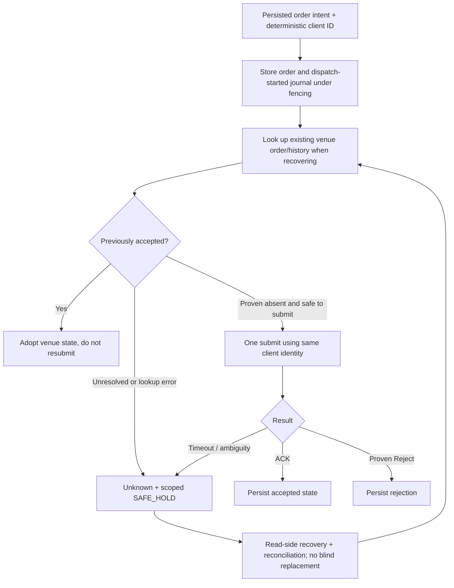

# Three-venue adapter contracts — verified from merged source (2026-09-22)

**Supported architecture scope:** Binance Portfolio Margin, Hyperliquid and Interactive Brokers. **Equal interface does not mean equal completion.** Every adapter translates venue transport and account/order truth into `pg-marketdata`, `pg-execution`, `pg-reconcile` and OMS types; venue-specific authentication, recovery, market data, fee history, reduce-only and account segregation must remain explicit. Start with [architecture](ARCHITECTURE.md), [runtime](PRODUCTION_RUNTIME.md) and [release gates](RELEASE_READINESS.md).

## 1. Current capability matrix

| Venue | Adapter/source | Runtime market-data source | Shadow execution | Real `paper/live` registration | Account/order acceptance |
| --- | --- | --- | --- | --- | --- |
| Binance PM | `rust/adapters/pg-binance`: public/private parsing, user stream, signed trade-history, isolated probes, order-level fill components | **No**. A `BINANCE_PM` derived feed fails startup | In-process adapter registered, but cannot start a strategy needing missing feed | **No**: `live_daemon::build_real_adapter_registry` explicitly bails | Not demonstrated; account-wide cursor/position settlement incomplete |
| Hyperliquid | `pg-hyperliquid` official `hyperliquid-dex/hyperliquid-rust-sdk`, behind `sdk` | Yes, default `hyperliquid-marketdata`; WS trades/BBO/L2/candles | Yes | Yes, real SDK adapter is constructed; `paper` only allows Testnet | Staging/fault/fees/real-order signoff absent in this review |
| IBKR | `pg-ibkr` via maintained **community** `ibapi` crate (not official Rust SDK) behind `sdk` | Yes, opt-in `ibkr-marketdata` TWS/IB Gateway; Docker build enables it | Yes | Yes, real TWS adapter is constructed, including composite for dynamic symbols | **Paper-account identity must be independently enforced**; full emergency acceptance absent |

`pg-core --serve` selects shadow daemon for `shadow` and real adapter daemon for **both** `paper` and `live`. Shadow execution does not call an exchange. Paper uses external venue API and can place external orders; **do not infer from the name `paper` or `PG_LIVE_TRADING=false` that an IBKR account is safe**. In this source review, Hyperliquid explicitly enforces Testnet for paper; IBKR builder does not independently prove paper mode/account identity. A real Binance PM route is absent, regardless of diagnostic feature coverage.

## 2. Shared order identity and ambiguous outcomes



`ExecutionError::Unknown` means no proof of the external side effect; it is **not** `Rejected`. Local PostgreSQL lease/fencing prevents stale writers from authoritatively updating store state but does not cancel an already accepted exchange order. Client IDs, owned-order history, fill accounting, order/position snapshots and testable reconciliation must close the gap.

## 3. Hyperliquid

- **Data:** official SDK websocket mapping into normalized trades, best bid/ask, L2 and candles. Feed freshness and sequence semantics remain explicit; do not synthesize exchange ordering.
- **Identity:** persisted `OrderIntent` UUID maps to the native `cloid`. Before a replayed submit and after an ambiguous error, search for that `cloid`; adopt found venue truth; unresolved errors return `Unknown`, never unconditional new POST.
- **Recovery:** open/historical orders, fills and account positions are mapped into shared snapshots. Partial fill is not equivalent to ACK/full fill. Native reduce-only is used where supported.
- **Real adapter construction:** `live_daemon` requires `HYPERLIQUID_ACCOUNT_ADDRESS` and a secret from `HYPERLIQUID_AGENT_PRIVATE_KEY` or `HYPERLIQUID_PRIVATE_KEY`; performs initial positions/open-orders/account reads. If `PG_RUN_MODE=paper`, `HYPERLIQUID_NETWORK` must be `testnet`. Configuration of a real adapter is not verified end-to-end custody or fee reconciliation.
- **Evidence to collect:** segregated funded/limited Testnet account, read/auth permission proof, actual one-order lifecycle with fills/fees, cancel/partial fill, lost ACK, reconnect and lease/DB failure injection, verified owned-only emergency exit and operator approval before any real-money canary.

## 4. Interactive Brokers (IBKR)

- **Binding:** TWS / IB Gateway via community `ibapi` (repository integration previously documented version `4.0.1`); not an official IBKR Rust SDK. TWS streams tick-by-tick trades, bid/ask, depth and five-second realtime bars, normalized into the same market-event contract.
- **Feed identity:** the relevant IBKR tick path provides no trustworthy monotonic exchange sequence, so normalized `MarketEvent.sequence` remains `None`; use freshness/reconnect/snapshot, not fabricated gap detection.
- **Runtime:** `ibkr-marketdata` opt-in Cargo feature; image `PG_CORE_FEATURES` defaults to `ibkr-marketdata`. `IBKR_GATEWAY_ADDR` defaults to `127.0.0.1:4002` in source documentation, while production Compose defaults to `ib-gateway:4002`; Docker gateway service is opt-in with `--profile ibkr`. Startup requires real account/order/position reads and fails if venue cannot be constructed.
- **Identity:** intent `client_order_id()` maps to `order_ref`; recovery checks open orders -> completed orders -> execution reports with `order_reference`. Fast orders may appear only in execution history; a missing open order is **not** permission for a duplicate.
- **Dynamic universe:** venue composite registers a per-instrument execution child/client ID and retains an account-capable child when the scanner temporarily has no desired symbols. Any runtime topology failure holds entries until a successful application; reconciliation alone does not clear a topology blocker.
- **Reduce-only:** ordinary stock orders do not have venue-native atomic reduce-only in this adapter. Default rejects reduce-only; `IBKR_ALLOW_SOFTWARE_REDUCE_ONLY=true` performs a fresh position-direction/size/cross-through-flat check but has a race window. `live_daemon` requires the flag in live mode. Treat this as weaker than native exchange enforcement.
- **Critical paper isolation:** `paper` constructs a real TWS execution adapter; the real adapter builder does not itself assert the connected account is paper. The Compose gateway defaults to paper and read-only API, **but environment overrides or external gateways can invalidate both defaults**. A read-only API cannot be the basis of an order-filling paper acceptance test. Verify actual account identity and Gateway mode out of band and fail closed on mismatch before running the order-capable paper daemon.
- **Environment:** `IBKR_GATEWAY_ADDR`, `IBKR_CLIENT_ID`, `IBKR_EXECUTION_CLIENT_ID_BASE`, `IBKR_ACCOUNT`, `IBKR_MARKET_DEPTH_ROWS`, `IBKR_DEFAULT_EXCHANGE`, `IBKR_DEFAULT_CURRENCY`, `IBKR_ALLOW_SOFTWARE_REDUCE_ONLY`; per-asset contract metadata must not be guessed from a ticker if unavailable.

## 5. Binance Portfolio Margin (PM)

`pg-binance` is a **third venue boundary**, not the architecture's global diagnostic prerequisite. Existing components include strict public/private event decoding, PM user stream, signed UM trade-history parsing/pagination/ownership verification and isolated immutable fill/OMS settlement primitives. Private diagnostic executables (e.g. `pm_user_probe`, `pm_history_probe`) are separately operator-approved and **not called by the normal daemon or CI with production credentials**. Their exact permission/secret preconditions and limitations belong only in [PM isolated evidence](PM_ISOLATED_READ_ONLY_EVIDENCE.md).

The current daemon has neither a `BINANCE_PM` runtime `MarketDataSource` nor a registered PM real execution/recovery adapter. A PM strategy requiring feed subscriptions fails startup; the real adapter builder explicitly refuses `BinancePm`. Isolated read-only probes do not submit, persist authoritative account cursors/positions, mutate OMS, release SAFE_HOLD or prove full authenticated REST reconciliation. A successful page after a supplied trade anchor does **not** prove historical completeness. Integration requires real account scope/permissions, all-order inventories, complete signed trade/fill/fees history, durable account cursor and atomic fenced reconciliation with OMS/positions, plus separate order lifecycle and fault-injection proof. See [Binance acceptance](ISOLATED_HFT_ACCEPTANCE_2026-09-22.md).

## 6. Simulation, advanced order semantics and data resolution

`ShadowExecutionAdapter` is constructed for all three **venue identities** but never touches a real execution endpoint. `PG_SHADOW_FILL_MODE=rest` only ACKs orders; `immediate` simulates full fills. A repeated client ID adopts its existing simulated order; resting-order cancellation and software reduce-only checks are defined in shadow. Binance PM cannot receive the required runtime market data even though the shadow registry contains its key.

`pg-sim` adds deterministic IOC/FOK/GTC/GTD/DAY, auction, post-only, reduce-only, iceberg and OCO/OTO/OUO semantics to research; **do not map those order types onto live Hyperliquid/IBKR/Binance adapters without explicit venue capability validation**. Python `RustSimClient` uses a persistent JSONL worker. Queue bounds and latency/fees in replay are hypotheses until calibrated against actual captured fills, not an HFT PnL claim.

A cross-venue strategy derives its `FeedSpec` from required features and each venue's candle capability. Hyperliquid default candle resolution is 1 minute and IBKR 5 seconds according to source documentation. Unsupported configured resolution/features fail loading. The daemon validates requested feed coverage before it can run; it must not reconnect forever for a venue or interval it cannot serve.

## 7. Acceptance recipe and security

```text
source compiles -> adapter registered -> authenticated reads -> observed fills and fees
 -> full OMS/journal/position reconciliation -> restart/fault/emergency proof
 -> independently reviewed allowlist/capital limit -> separately authorized canary
```

Each arrow is an independently evidenced gate. Run feature tests offline with `cargo test -p pg-hyperliquid --features sdk`, `cargo test -p pg-ibkr --features sdk`, `cargo test -p pg-binance --all-targets`; check the exact final commit's CI and isolated PostgreSQL integration job. Neither compilation nor `/readyz` is proof of venue release acceptance. Never put production account API keys, private keys or trading credentials in GitHub Actions, diagnostics output, PRs or documentation. No CI/release step may touch the incumbent Binance PM/Freqtrade production bot or manually owned exposure.
