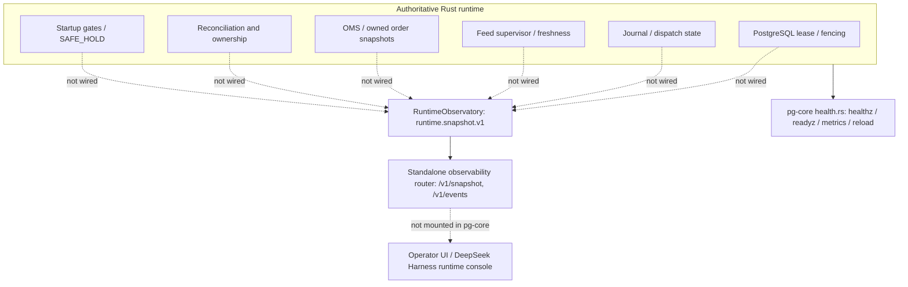

# Observability architecture and integration status (2026-09-22)

> **Important post-merge correction:** `pg-observability` is a Rust workspace member containing `RuntimeObservatory` and an HTTP API implementation, **not currently a dependency or route of the shipping `pg-core` executable**. Do not advertise `GET /v1/snapshot` or `GET /v1/events` as available on the running daemon, dashboard or deployed server. See [ARCHITECTURE](ARCHITECTURE.md), [STATUS](STATUS.md) and [RELEASE_READINESS](RELEASE_READINESS.md).

## 1. Implemented versus wired

| Component | Source status | Callable from `pg-core` currently? |
| --- | --- | --- |
| `rust/crates/pg-observability/src/lib.rs` | Implements `runtime.snapshot.v1` schema, `RuntimeObservatory`, bounded process-local events and HTTP router | **No.** `rust/crates/pg-core/Cargo.toml` does not depend on `pg-observability`; its `health.rs` does not mount this router. |
| `GET /v1/snapshot` | Implemented in the observability crate's router | Not provided by `pg-core --serve` |
| `GET /v1/events?after=N&limit=...` | Implemented in the observability crate's router | Not provided by `pg-core --serve` |
| `GET /healthz` | Implemented in `pg-core/src/health.rs` | Yes |
| `GET /readyz` | Implemented in `pg-core/src/health.rs` | Yes |
| `GET /metrics` | Implemented in `pg-core/src/health.rs` | Yes |
| `POST /admin/reload` | Implemented in `pg-core/src/health.rs`; enqueues reload only | Yes; **handler has no authentication**, so restrict network exposure |

The presence of `pg-observability` in workspace Cargo is **not an executable integration test**. The merged PR #10 preserved the library/history but did not establish daemon-to-observatory authority or route registration.

## 2. Intended evidence topology — not yet end to end

A connected dashboard must not infer that the system is `NORMAL` because a process listens on a port or because the observability crate can construct an example snapshot. Missing source evidence is `UNKNOWN`/`PENDING` and forces conservative safety semantics in the observability model; the model itself has no order authority.

## 3. Library API contract

The separate router defines `GET /v1/snapshot` and `GET /v1/events?after=<seq>&limit=<1..200>`. Its intended configuration is `PG_OBSERVABILITY_BIND` (loopback `127.0.0.1:8787` by default), `PG_OBSERVABILITY_STALE_AFTER_MS`, `PG_OBSERVABILITY_EVENT_CAPACITY` and bearer `PG_OBSERVABILITY_TOKEN` when binding non-loopback. These settings describe the **standalone crate contract**, not an endpoint that currently exists in `pg-core`.

Snapshot fields are designed to report runtime identity/mode, exposure safety, lease heartbeat/fencing, journal/checkpoint/dispatch evidence, feed health, venue execution/reconcile health, strategies, owned/manual/unknown positions, open/partial/unknown OMS state, optional performance, operator capabilities and all required startup gates. Unwired fields must retain `UNKNOWN` or `PENDING` instead of defaulting to green or fabricated zero losses. An API schema version does not prove that all fields have authoritative producers.

Event sequences are process-local and held in a bounded memory ring, with cursor `seq > after`. A ring buffer is **not** the PostgreSQL trading journal and cannot prove an exchange did/did not accept a POST or that historical fills are complete. After a restart, clients must handle cursor reset and refresh authoritative snapshots rather than inventing continuity.

## 4. Integration acceptance to unblock advertising the API

- [ ] Add explicit `pg-observability` dependency and mount its router (or a carefully specified separate process) in the actual `pg-core` runtime; document binding and authentication.
- [ ] Feed authoritative lease heartbeat/fencing, journal/checkpoint, order and position snapshots, reconcile outcomes, per-venue feeds, startup gates and HALT events into one observer; missing producer remains `UNKNOWN`.
- [ ] Prove `SAFE_HOLD` and `allow_new_exposure=false` on lease loss, unknown submit, stale feed, disconnected venue and reconciliation mismatch, including reconnection transitions.
- [ ] Exercise `/v1/snapshot` and paginated `/v1/events` through the **running daemon**, including bearer denial, loopback/non-loopback behavior, event loss and process restart.
- [ ] Keep UI/observer failure isolated from Risk/OMS/execution: no status polling or browser click may unlock exposure.
- [ ] Address the existing unauthenticated `/admin/reload` in `health.rs` before exposing operator HTTP surfaces beyond trusted loopback; production Compose's host port defaults to `127.0.0.1`, but direct bare-metal deployment must be secured too.

Until these checks pass, the publicly documented working endpoints are only `/healthz`, `/readyz`, `/metrics` and the network-restricted `/admin/reload`. The existing production Binance PM/Freqtrade bot and manual positions must not be connected or modified by observability experimentation.
