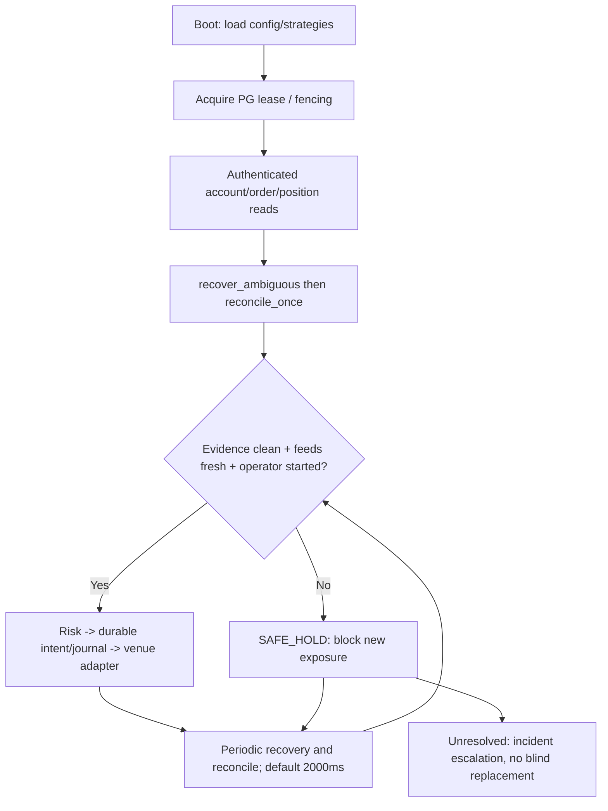

# Operator runbook and deployment boundaries — 2026-09-22

**This is a source-verified operator design/runbook, not evidence of deployed, production-authorized service.** The first research/shadow candidate and real-money release have separate gates in [RELEASE_READINESS](RELEASE_READINESS.md). This repository is independent from the incumbent Binance PM/Freqtrade production bot and must not touch it or manual positions.

## 1. Modes and account safety

| Mode | What current source does | Operator rule |
| --- | --- | --- |
| `shadow` | `daemon::serve` uses simulated execution; can consume real Hyperliquid/IBKR market feeds | Safe candidate for credential-free *execution* smoke after proving no real order path; PM feed not wired |
| `paper` | `live_daemon::serve` constructs **real Hyperliquid/IBKR order adapters** | Do not run unless verified Testnet/paper account; Hyperliquid enforces Testnet, IBKR code does not prove paper identity yet |
| `live` | `live_daemon::serve` constructs real adapters, requires explicit `PG_LIVE_TRADING=true` | **NO-GO** until venue-specific external full-cycle and operator acceptance; Binance PM explicitly fails registration |

`PG_LIVE_TRADING=false` does not make paper side-effect-free. Paper's code-level default `PG_AUTO_START=true` differs from production Compose default `false`; inspect the resolved environment before starting. No API keys/secrets in GitHub Actions, shell history, PRs or logs.

## 2. Startup safety checklist

`pg-runtime` defines 11 gates; the actual subset depends on mode. The full live set is:

1. Journal writable (`JournalWritable`).
2. Database reachable (`DatabaseReachable`).
3. PostgreSQL runtime lease owned and fencing valid (`RuntimeLeaseAcquired`).
4. Venue authenticated (`VenueAuthenticated`), **account identity and permissions independently verified**.
5. Market data synchronized/fresh (`MarketDataSynchronized`). **Do not insist on invented sequence numbers** for IBKR: its tick path keeps `sequence=None`, using freshness/reconnect/snapshot.
6. Open orders loaded (`OpenOrdersLoaded`).
7. Positions/balances loaded (`PositionsLoaded`).
8. Ownership reconciliation complete (`OwnershipReconciled`).
9. Unknown external outcomes cleared from authoritative proof (`UnknownStateClear`).
10. Strategy allowlist loaded (`StrategyAllowlistLoaded`).
11. Explicit live key enabled (`LiveTradingExplicitlyEnabled`).

An additional `EntryGuard` requires operator start, clean initial/periodic reconciliation, connected feeds and validated dynamic topology. A clean later reconcile does not release a sticky topology failure. Live gate success is not itself independent production acceptance.

## 3. Runtime loop and incident transitions

Distinguish known ACK, known Reject and `Unknown`; an exchange timeout cannot justify creating a second client ID. A complete WebSocket reconnection is not authenticated historical fill reconciliation. PostgreSQL fencing prevents stale local writes, not an order already accepted by an exchange. Separate manual and strategy-owned positions; never auto-adopt or flatten manual/unknown exposure.

## 4. Health, observability and control

The wired handler exposes `GET /healthz`, `GET /readyz`, `GET /metrics` and `POST /admin/reload`. `/healthz` is liveness, **not** proof the venue/order/fee state matches. `/admin/reload` has no auth in `health.rs` and binds `0.0.0.0:8080` by default. Production Compose restricts host mapping to `127.0.0.1`; standalone deployments must explicitly bind/proxy/firewall a trusted network. The separately merged `/v1/snapshot` and `/v1/events` observability crate is **not attached** to the shipping `pg-core` router. Telegram emergency control is an unverified contract, not a proven production kill switch.

For an incident, preserve event and order IDs, immutable journal, lease/fencing identity, venue truth, time/window, account and ownership evidence. Do not label an unverified empty list of current open orders as proof that historical fills do not exist. Escalate unresolved cancellation/flatten outcomes rather than claiming exposure is flat.

## 5. Shutdown and rollback

`PG_SHUTDOWN_POLICY` chooses `preserve`, `cancel_resting` (default) or `flatten_owned`. The code applies the policy at exit and attempts to cancel resting orders before a reduce-only owned flatten; **no authenticated completion proof or safe unattended emergency acceptance has been recorded**. Never issue a blanket close/flatten across manual holdings. An ambiguous cancel/flatten must stay in an incident state and trigger authoritative exchange reads/operator escalation.

The release rollback plan must preserve existing database/journal data and fencing leases, prevent split-brain writers and require reconciliation before restarting entries. Do not use a GitHub Actions workflow, docs-only commit or a moving `main` to deploy trading configuration. The existing Binance PM/Freqtrade bot is not a target of this project's Compose or rollback.

## 6. First-release operational gate

Before even publishing a research/shadow prerelease: pin exact SHA, confirm complete final-SHA CI and isolated PostgreSQL success, independently review PR #10 simulator/observability merges, clean release-build, `pg-sim` and Python parity, strategy replay, Postgres-backed shadow lifecycle/restart, feed/ownership/fencing failure behavior, Docker build/start/health and reproducible artifacts. Write recorded results and a shadow-only release note. A `v0.1.0-rc.1` tag/Release must not be claimed until it exists. Paper/live additionally require individually segregated exchange accounts, real order/fill/fee/position history and emergency/fault acceptance signed off by an operator.
