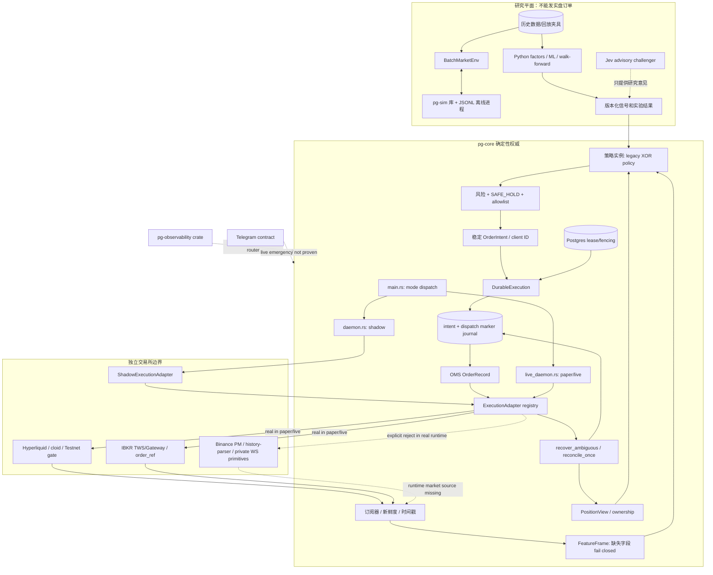
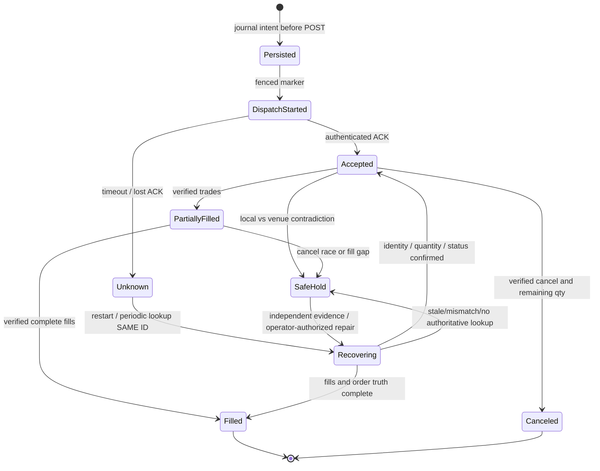
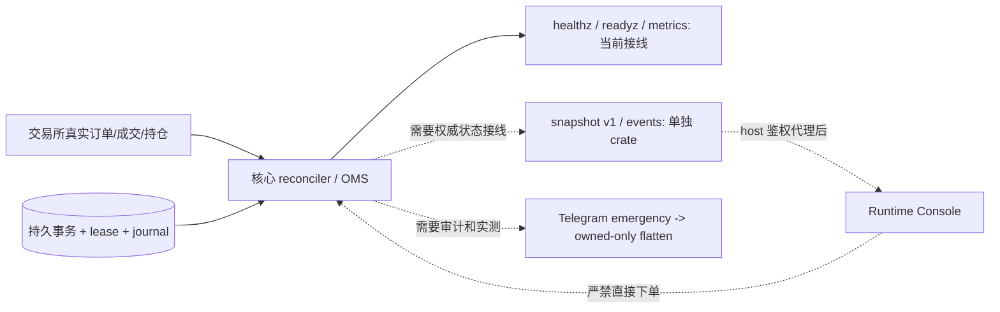

# PG-TSY 生产闭环架构与验证规范

> 2026-09-22 | `v0.1.0-rc.1` 后的 hardening 分支。**架构、源码实现、CI 结果和真实交易所验收是四件不同的事。** 本文描述当前代码已经接通的路径、尚未接线的目标、失败时禁止跨越的门禁及测试设计；不宣称已达到生产实盘级别。本轮只修仓库，不部署、不使用真实 API Key、不修改现有 Binance PM/Freqtrade 机器人和人工仓位。

阅读路线：[ARCHITECTURE.md](ARCHITECTURE.md)（基础拓扑）→ 本文（执行/恢复设计）→ [EXCHANGES.md](EXCHANGES.md)（venue 差异）→ [ENGINEERING_AUTOMATION.md](ENGINEERING_AUTOMATION.md)（CI/自动验收）→ [RELEASE_READINESS.md](RELEASE_READINESS.md)（上线闸门）→ [OPERATIONS.md](OPERATIONS.md)（事故手册）。

## 一、闭环的严格定义

**完整闭环不是从行情收到买卖信号。** 对每个独立 venue、账户、策略和 instrument，完整循环包括：身份和行情确认、策略决策、可用于开仓资金和风险审核、落库/日志先行、唯一客户端订单 ID、外部订单受理、订单/成交/手续费读取和回推、OMS 成交状态和账户持仓原子归集、checkpoint/cursor 推进、持续对账、异常 SAFE_HOLD、故障恢复、经认证的停机/只减仓动作及其真实成交确认。每一步必须允许断电后用持久证据继续，不可借助 RAM `acked` 布尔值推断交易所没收到订单。

| 层级 | 可验证声明 | 禁止的推断 |
| --- | --- | --- |
| `DEFINED` | trait、schema、代码文件存在 | 交易所已经连接 |
| `COMPILES` | 固定 SHA / feature 编译和 Clippy 成功 | 下单权限、到账正确 |
| `WIRED` | 实际 daemon 实例化、启动门禁、事件消费、出入站被观察 | 私有订单/成交齐全 |
| `REPLAYED` | 无凭据 fixture 与断点测试通过 | 真实账户 API 行为一致 |
| `AUTHENTICATED` | 专用账户 REST+WS、完整订单/成交/费用和权限证据 | 崩溃恢复正确 |
| `FAULT-PROVED` | 注入超时/kill-9/DB/lease 后反复恢复且无重复敞口 | 另一个 venue 同样完成 |
| `LIVE-ACCEPTED` | 独立运维签名 + 账户上限 + 持续监控 + rollback | 可在所有市场全天候无人值守 |

## 二、源码上的运行时拓扑



**注意两种图中含义**：实线表示代码中有对应路径，**不是说外部真实验收通过**；虚线表示明确缺失或验证未完成。`shadow` 即便订阅真实行情，订单也走 `ShadowExecutionAdapter`；`paper/live` 会创建 HL/IBKR 外部适配器，所谓 paper **并非**本地无害模拟。`pg-runtime::routes_to_real_venue()` 只在 `live` 返回 true，并不能被用于证明 paper 不发外部请求。Binance PM 在真实适配器注册处明确 `bail`。

## 三、三交易所身份与安全隔离

| Venue | 市场数据 | 身份和幂等定位 | paper/测试账户证明 | 真实全链路状态 |
| --- | --- | --- | --- | --- |
| Hyperliquid | 默认 feature HL WS; normalized Trade/BBO/L2/candle | 持久化 UUID→`cloid`；提交前 lookup；不确定受理按相同 ID 恢复 | paper 代码要求 Testnet，仍需实测签名、实际 fills/cancels/fees/positions | 适配器有源码与测试，缺独立故障/账户完整验收 |
| IBKR | `ibkr-marketdata` feature；Gateway/TWS trade/BBO/depth/bars | `order_ref` 标识，open→completed→executions 恢复；订单可能归属多个 TWS client | **未能证实真实纸面账号/端口强制校验**；Gateway `TRADING_MODE=paper` 配置文字不足以证明订单目标账户 | 严禁在未知会话验证 paper 单；股票 native reduce-only 不存在，软件减仓必须考虑跨零竞争 |
| Binance PM | parser、私有 WS、历史工具和独立只读 probe | 目标为稳定 client ID + PM REST/Algo 订单 + 成交唯一键 | 专用 PM account scope、读取权限、REST+WS 一致性与完整 history cursor 尚无全量证据 | runtime feed 没注册，real ExecutionAdapter 拒绝，不应声称已接通 |

IBKR 的 paper 账户必须在产生任何外部副作用之前通过认证 API 取得并校验账户标识、交易模式、目标账户 allowlist 和连接端口/地址，不可只信环境变量字符串。若 IB Gateway/TWS 暴露信息不足，必须保持 `paper` 的 IBKR 外部订单 gate 关闭。对 Hyperliquid 网络/agent/主账户需避免混用 Testnet/Mainnet；对 PM 不可把现有 Binance 风控机器人的余额和 Key 直接迁进新仓库。venue 特定订单类型、tick size、lot step、币种、margin、融资、止损与撤单语义只在 adapter 的 capability contract 中解析，无法证明时拒绝而非降级。

## 四、行情到订单的确定性顺序

```mermaid
sequenceDiagram
  autonumber
  participant M as Venue WS / TWS
  participant F as MarketDataSource + Supervisor
  participant P as Strategy/Policy
  participant R as Risk + Ownership + EntryGuard
  participant D as DurableExecution
  participant DB as PostgreSQL fenced store
  participant X as ExecutionAdapter
  M->>F: Trade/BBO/L2/Candle + source timestamps
  F->>F: sequence/age/reconnect, reject stale or gap
  F->>P: normalized MarketEvent -> FeatureFrame
  P->>P: legacy XOR policy; compute target/delta
  P->>R: stable OrderIntent incl venue/account/asset/owner
  alt stale, missing feature, unknown ownership, lease lost
    R-->>P: reject entry; preserve SAFE_HOLD reason
  else passed
    R->>D: approved intent
    D->>DB: assert lease and fencing token
    D->>DB: persist OrderRecord + intent event
    D->>DB: SubmitRequested + dispatch.started
    D->>DB: assert fencing immediately before side effect
    D->>X: submit with stable client identity
    alt exchange ACK
      X-->>D: accepted venue order id
      D->>DB: ACK record + journal (fenced)
    else explicit reject
      X-->>D: rejection evidence
      D->>DB: rejected state + reason
    else response timeout/unknown
      X--xD: ambiguous outcome
      D->>DB: unknown/pending record, NO new client ID
      D-->>R: SAFE_HOLD scope
    end
  end
  loop periodic refresh / restart
    D->>X: lookup stable ID, open/completed/trades/positions
    X-->>D: authoritative snapshots, or unknown
    D->>DB: compare immutable local vs remote BEFORE mutation
    alt valid verified evidence
      D->>DB: checked transition + fill journal + reconcile report
    else mismatch/unavailable
      D->>DB: mismatch report and scoped SAFE_HOLD
    end
  end
```

这里的连续 reconcile 实现存在于 `live_daemon` 周期分支，`DurableExecution` 已包含 `recover_ambiguous` / `reconcile_once` 与较严格的 preflight。**设计上的独立成交表、精确费用和账户维度原子 cursor 仍须逐 venue 验证，不能从一条累积成交量 snapshot 自动推导出完整成交明细。**

## 五、交易记录不变量与原子账本

一个 durable intent 标识建议 `(venue, account_scope, client_order_id)`；每个实际成交用 `(venue, account_scope, trade_id)` 或 venue 提供的等价强唯一键去重。客户端 ID 必须来自首次 intent，重启、POST timeout、cancel/recovery 都不得因旧 ACK 未写入而产生另一个 ID。若 venue ID 已绑定不能更换；若 asset、side、原始 quantity 与 durable 记录冲突，直接记 mismatch，不得先把本地记录覆盖成远端再比较。

逻辑约束（所有数量为 `Decimal`，禁止 float 用于精确仓位对账）：

```text
0 <= cumulative_filled <= original_quantity
cumulative_filled(new) >= cumulative_filled(old)
remaining = max(original_quantity - cumulative_filled, 0)
order_fill_sum = SUM(unique authenticated trade fill quantity)
POSITION(after) = POSITION(before) + signed owned fills + proven external/manual changes
cursor_advance => every record through cursor committed with fills, fees, OMS and positions
```

若 `order_fill_sum != exchange cumulative_filled`，先判定是成交数据缺页、时滞还是冲突并 SAFE_HOLD，不能强行“补齐”一个虚构 trade。价格/费率要记录实际成交价、fee amount/currency、maker/taker、交易时间和交易所 trade ID；手续费币种不可默认为 USD。跨账户或跨币种可能不存在全局单一 cursor；必须按 venue 分页语义及账户维度定义 checkpoint，按快照边界保证不漏单、不提前推进。提交数据和 cursor 的事务必须受当前 fencing token 约束，旧 leader 恢复后不得覆写新 leader 状态。

## 六、恢复、矛盾与 SAFE_HOLD



执行顺序为 `load durable records → query venue truth → compare original immutable local/remote → persist mismatch report / SAFE_HOLD → only then checked mutation`。校验 client/venue ID、账户、symbol、side、原始数量、累计 fill 单调性和终态，不采用“远端 snapshot 有值就认为比本地正确”策略。`recover_ambiguous` 已不等于‘没查到订单就重发’：有最终性窗口或读取不确定时保持 unknown。`reconcile_once` 的纯函数单测不得替代 orchestrator+DB+adapter 整条调用顺序测试。

**策略可否解除 SAFE_HOLD：** lease owned & healthy、数据库和 journal 可写、所有 required feed 新鲜且序列同步、订单无 unknown、归属证明没有冲突、账户和持仓与独立交易所真相一致、策略 allowlist 合法、实际模式需显式运维授权。这是多项 AND，不得让最近一次健康 ping、空 WS、模型认为行情正常、后台服务重启来解除门禁。恢复后先确认已有 pending/filled/conditional/Algo 订单归属，再考虑任何增加敞口动作。

## 七、故障注入及验收矩阵

| 故障 | 核心断言 | 证据来源 | 当前结论 |
| --- | --- | --- | --- |
| POST 前 kill-9 | intent 或无 side effect；重启只查原 ID | frozen journal / fake adapter | 需端到端重复验证 |
| 交易所受理、ACK 落库前 kill-9 | 查询相同 client ID；绝不盲重复 POST | venue ack/trades + DB | 组件回归有覆盖，仍需每 venue 认证验收 |
| REST timeout，随后 lookup 暂时为空 | 持续 UNKNOWN/SAFE_HOLD，无新 exposure | injected timeline | 实盘证据缺失 |
| partial fill + cancel 同时发生 | 成交按 unique trade ID 落库、剩余 qty 与 cancel 确认 | user/execution stream + signed history | 需跨 adapter/DB 验收 |
| PG17 中断/事务回滚 | cursor 不超前，fencing 拒旧进程 | isolated PG workflow | 组件 CI 有证据，不证明实盘账户语义 |
| 双实例旧 leader 重连 | 旧 token 无法进行状态写或增加敞口 side effect | lease/fencing tests and fault harness | 跨机器外部验收待做 |
| feed gap / staleness | 不增加敞口；reconcile / proven exits 仍可执行 | supervisor tests | 需连续 daemon 验证 |
| 人工仓位与策略仓位并存 | 不将手动仓位收编，不越权减仓 | ownership fixtures | venue/account 级验收待做 |
| IBKR Paper 接真实 Gateway | 拒绝**所有外部提交**，留痕并启动失败 | authenticated account identity | **阻断项** |
| Binance PM 私有历史缺页 | cursor 不前移，SAFE_HOLD，禁止只用 WS 当完整历史 | signed history / page boundary | **阻断项** |
| Telegram emergency 重复/中断 | 命令 ID 幂等，先 HALT 新单，确认自有持仓归零 | audit+venue fills+orders | **阻断项** |

故障注入至少保存事件时间、订单 ID（匿名化）、DB 前后原始快照、注入点、所有 POST 次数、venue 的真实订单和逐笔成交、SAFE_HOLD 原因、恢复动作、验收人。失败就是失败，不能通过降低 strict assertions 或跳过 test 来得到绿色结果。

## 八、控制平面与可观测性分离

`pg-core/src/health.rs` 当前提供 `/healthz`（活着）、`/readyz`（启动与状态门禁）、`/metrics`（当前有限进程/事件/订单数）及 `/admin/reload`（请求重新加载，需隔离访问）。`pg-observability` crate 单独实现 `runtime.snapshot.v1` 和 `/v1/events` 数据结构/HTTP，但是 **没有成为现网 `pg-core` 依赖和 router**；控制台不能显示模拟全绿或凭配置文件声称为实际交易证据。要接线需权威事件点推送 lease、订单 UNKNOWN、feed age、reconcile/mismatch、position owner 等真实状态；事件 ring buffer 不等于可恢复的 journal。



HTTP 控制命令需用户鉴权、角色/账户权限、nonce/request ID 幂等、动作审计、速率限制和绑定地址；Compose 将 8080 映射至主机 loopback 不等于服务内部 `0.0.0.0` 的接口本身有鉴权。在未完成鉴权前不向公网发布 admin 控制端口。

## 九、紧急减仓必须是一条独立、可重复证明的链

目标顺序：身份认证 → audit command ID → HALT 所有新敞口 → 查询最新订单/仓位+ownership → 取消确认属于本策略的挂单（包括 Algo/条件单）→ 再查成交与持仓 → venue 原生 reduce-only 或经过竞态证明的风险减仓护栏 → 查询成交/剩余仓位 → 确认 flat 或保持 SAFE_HOLD，并提供人工接管入口。异常重试只复用稳定减仓 intent/订单 ID；未知成交量不能直接提交同名义额第二个平仓单。IBKR 普通证券没有原生 reduce-only，执行前后都必须核对账户级持仓和并发人工作业。手工/unknown 仓位不允许因为“紧急”二字被清仓。

## 十、交付与版本边界

当前发布的 `v0.1.0-rc.1` 不应移动、不应补上传称实盘镜像。修复保存在独立 `hardening/post-rc1-production-closure` 分支；每条代码应先通过 `ENGINEERING_AUTOMATION.md` 的 G0–G4，再由独立审查合并。Paper/Live 以及三 venue 的生产级别只能由隔离环境的 G5/G6 外部证据分开认证。本轮明确不部署，因此即使离线 CI 全绿，最终可声明的也只是**源码修复和本地/隔离 CI 闭环**，不能宣称真实账户无人值守闭环已完成。
