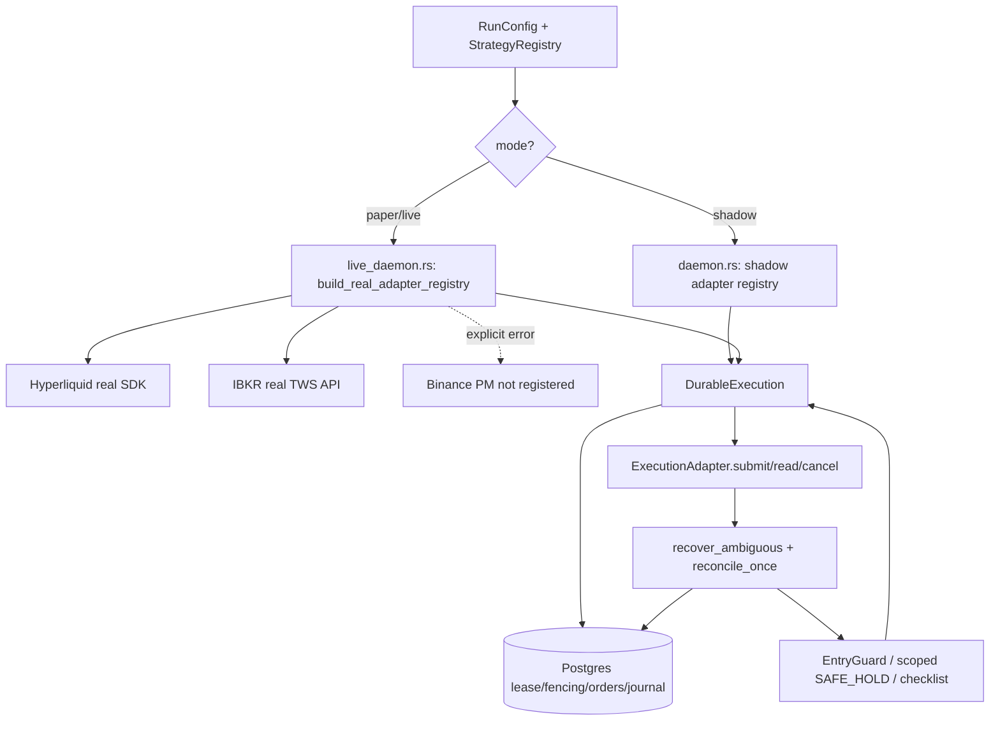

# Runtime and deployment contract — code-verified 2026-09-22

> **Not a production authorization.** `pg-core` has shadow, paper and live code paths. Only source/tests have been reviewed here; there is no accepted multi-venue real-account end-to-end proof. Review [ARCHITECTURE](ARCHITECTURE.md), [EXCHANGES](EXCHANGES.md) and [RELEASE_READINESS](RELEASE_READINESS.md). Never run these commands with an incumbent Binance PM/Freqtrade production account.

## 1. Actual CLI entry point

`rust/crates/pg-core/src/main.rs` dispatches `pg-core --serve` by `RunConfig::mode`:

| `PG_RUN_MODE` | Entry | Adapter construction | External order risk |
| --- | --- | --- | --- |
| `shadow` | `daemon::serve` | in-process `ShadowExecutionAdapter` for three venue identities | Simulated execution only; Hyperliquid/IBKR may supply real market data |
| `paper` | `live_daemon::serve` | **real Hyperliquid/IBKR adapters**, never falls back to shadow | **Can submit external orders** to the configured testnet/paper **or live account if misconfigured** |
| `live` | `live_daemon::serve` | real Hyperliquid/IBKR adapters | Real orders possible after gates/start; `PG_LIVE_TRADING=true` required |

In all modes Binance PM runtime market-data subscriptions are unsupported; in `paper/live`, its real adapter registration deliberately fails with `BINANCE_PM remains fail-closed`. Do not describe paper as a simulated venue, or describe the daemon as shadow-only.

`RunConfig::routes_to_real_venue()` evaluates `mode == live && live_trading_enabled`; **this is a configuration predicate, not an enforcement that paper has no side effects**. In `live_daemon`, Hyperliquid paper requires `HYPERLIQUID_NETWORK=testnet`. The IBKR adapter is built using the supplied TWS/Gateway connection; no code-level assertion in `build_real_adapter_registry` establishes the account is IBKR paper. Keep order-capable IBKR paper runs blocked until that is independently enforced and tested. Live IBKR additionally requires `IBKR_ALLOW_SOFTWARE_REDUCE_ONLY=true`, which is a software position guard, **not** venue-native atomic reduce-only.

## 2. Component wiring



The source order for `DurableExecution::dispatch`: assert lease -> save `OrderRecord` -> append `order.intent.persisted` -> mark `SubmitRequested` -> save and append `order.dispatch.started` -> assert fencing -> invoke adapter -> persist known ACK, rejection or ambiguous outcome. A lease token protects local store writes, not a venue POST already accepted during failover. Stable client identity and exchange lookups must prevent blind duplicate submissions. This invariant needs real fault testing before unattended use.

## 3. Startup and periodic operation

Live checklist contains 11 gates: journal writable, database reachable, lease/fencing owned, venue authenticated, fresh/synchronized market data, open orders loaded, positions/balances loaded, ownership reconciled, unknown outcomes cleared, strategy allowlist loaded, deliberate live key. `shadow/paper` require subsets (see `pg-runtime::required_gates`), **not the full live checklist**. `live_daemon` also requires nonempty derived feeds, registered venues and operator start. `PG_AUTO_START` defaults to `true` in paper and `false` in live unless overridden; this alone is no substitute for account segregation.

The real daemon acquires a PostgreSQL lease and heartbeat; builds venue adapters; reads account/orders/positions; runs initial `recover_ambiguous` followed by `reconcile_once`; then starts feed tasks and timers. Default periodic reconciliation is `PG_RECONCILE_INTERVAL_MS=2000` (allowed 250–60000 ms). On clean cycles, ownership/checklist and the independent `EntryGuard` may allow new exposure if the operator has started and feeds are connected. Unresolved outcomes, reconcile errors, stale/disconnected feeds or topology refresh failure block new exposure; an unrelated clean reconcile must not erase a topology failure. A full live-authenticated reconnect/fill/fee/position settlement has **not** been accepted for each venue.

```mermaid
sequenceDiagram
  participant D as Real daemon
  participant DB as PostgreSQL
  participant X as Venue adapter
  participant G as Entry guard
  D->>DB: acquire fenced lease
  D->>X: authenticate/read orders, positions, account
  D->>X: recover_ambiguous + reconcile_once
  X-->>D: verified or unresolved evidence
  D->>G: initial reconciliation + checklist
  loop interval default 2s
    D->>X: recover first, then reconcile
    X-->>D: orders/positions or error
    D->>G: clean -> gated readiness; dirty -> block new exposure
  end
  G-->>D: only validated operator-started decisions enter risk/OMS
```

## 4. Policy and fill caveats

A policy rule graph and the legacy automation engine cannot both dispatch for the same definition. Entries increase exposure only through risk and guards; policy exits are reduce-only. The shadow adapter simulates resting or immediate fills (`PG_SHADOW_FILL_MODE=rest|immediate`), and its position view includes simulated average price/return. **The real daemon's `position_view(quantity)` currently sets `average_entry_price=None`, `filled_entries=0`, `unrealized_return=None`, `peak_return=None`.** Rules requiring these live features must not be advertised as working until authentic mark/entry/fill data are wired.

Reconciliation and source-level OMS/fill components are not proof of exchange-authenticated complete trade/fee histories, account-wide cursor atomicity or independently verified ownership. Specific Binance PM limitations are documented in [PM diagnostics](PM_ISOLATED_READ_ONLY_EVIDENCE.md). A WebSocket reconnect alone never clears history uncertainty.

## 5. Health, controls and network exposure

The **currently wired** `pg-core/src/health.rs` HTTP handler provides:

| Endpoint | Meaning | Security note |
| --- | --- | --- |
| `GET /healthz` | Process health | HTTP 200 does not prove order-state safety |
| `GET /readyz` | Startup/lease/feed readiness | Not a venue-level admission certificate |
| `GET /metrics` | Prometheus counters/gauges | No performance proof |
| `POST /admin/reload` | Enqueue strategy reload | **Handler contains no authentication; do not publicly expose** |

`PG_HEALTH_ADDR` defaults to `0.0.0.0:8080`; `docker-compose.production.yml` maps the host side to `127.0.0.1`, but direct/bare-metal deployment must explicitly firewall/bind the endpoint. The `pg-observability` crate implements the separate snapshot/events model but is **not** a dependency of `pg-core`, and `health.rs` does not expose `/v1/snapshot` or `/v1/events`. They are planned integration, not running daemon endpoints. Telegram `pg-control` contracts do not yet establish an authenticated production `/emergency_exit` lifecycle; do not rely on them as a kill switch.

Shutdown policy `preserve | cancel_resting | flatten_owned` is configured by `PG_SHUTDOWN_POLICY` (default `cancel_resting`). The daemon applies it on exit; `flatten_owned` is intended for explicitly owned positions and reduce-only requests but is not evidence of tested live emergency completion. Operator exit, loss of lease and fault paths require independent verification, especially for manual positions.

## 6. Configuration and release-safe workflow

| Variable | Default / rule | Meaning |
| --- | --- | --- |
| `PG_RUN_MODE` | `shadow` in Rust config; **required explicit** in production Compose | Selects daemon path |
| `PG_LIVE_TRADING` | `false` | Additional live-mode key; does **not** make paper offline |
| `PG_AUTO_START` | `true` paper, `false` live, Compose supplies `false` | Operator entry state |
| `PG_DATABASE_URL` | required (`DATABASE_URL` fallback) | Durable PostgreSQL |
| `PG_LEASE_KEY`, `PG_LEASE_TTL_SECONDS` | derived / 15s | Fenced single-writer lease |
| `PG_RECONCILE_INTERVAL_MS` | 2000 | Continuous real-daemon recovery/reconcile cadence |
| `PG_MAX_MARKET_STALENESS_MS` | 3000 Rust; 10000 production Compose | Freshness budget |
| `PG_SHADOW_FILL_MODE` | `rest` | Shadow-only matching |
| `HYPERLIQUID_NETWORK` | configuration-specific | Must be `testnet` in paper |
| `IBKR_ALLOW_SOFTWARE_REDUCE_ONLY` | `false` | Explicit live IBKR guard; not native exchange guarantee |
| `PG_HEALTH_ADDR` | `0.0.0.0:8080` | Protect control listener |

Offline CI checks Rust/Python, workspace features and Compose config; the isolated PostgreSQL workflow validates store/fencing semantics. A Compose config pass neither builds nor deploys the runtime. Before preparing a **research/shadow** release candidate, pin exact SHA, review full Actions results, and run a clean-machine simulator/replay/Postgres-backed shadow smoke. Before touching paper/live, independently verify venue destination/account, full transaction and failure-injection acceptance and operator signoff. No real credentials in GitHub Actions. The separate incumbent Binance PM/Freqtrade bot and manual positions are never release targets.
