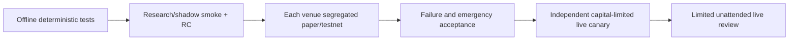

# Roadmap — evidence-driven three-venue first release (2026-09-22)

Status: **P0 integration/hardening; no published v1 and no unattended trading approval.** See [STATUS](STATUS.md), [ARCHITECTURE](ARCHITECTURE.md), [EXCHANGES](EXCHANGES.md), [RELEASE_READINESS](RELEASE_READINESS.md). Milestones refer to executable evidence, not number of crates, passing unit tests or nominal venue support.

## Already merged (source exists; not exchange acceptance)

- [x] Python research/factor/ML/tuning package, batch simulation, causal replay and Jev advisory/challenger evaluation.
- [x] Rust portable strategy/feature definitions, feed derivation, shared market-data, risk/OMS and execution contracts.
- [x] `pg-sim` deterministic matching kernel, JSONL worker and Python persistent client; PR #8/#9/#10 merge history preserved.
- [x] PostgreSQL leases/fencing, intent journal-before-adapter, order/ownership/reconcile records and isolated immutable fill/settlement tests.
- [x] Hyperliquid official SDK feed plus real execution constructor with `cloid` recovery; IBKR community `ibapi` feed plus real constructor with `order_ref` recovery.
- [x] `main.rs` chooses `daemon::serve` for shadow and `live_daemon::serve` for paper/live. Real daemon runs initial plus periodic `recover_ambiguous`/`reconcile_once`, protects new exposure with checklist/EntryGuard and independently keeps topology faults sticky.
- [x] Shadow simulation routes through Risk -> durable OMS/journal -> `ShadowExecutionAdapter` for venue identities whose feeds are supported.
- [x] `pg-observability` module was merged into the workspace; Telegram control contracts and HTTP health/ready/metrics/reload code exist.
- [x] GitHub Actions tests Rust workspace/feature crates, Python, lockfile, Compose syntax and independent PostgreSQL ledger/fencing; the pre-audit `293ba629` run succeeded on inspection.

**Important:** Binance PM real feed/execution is not registered; observability snapshot/events is not a `pg-core` endpoint; paper uses external Hyperliquid/IBKR adapters; live strategy quantity lacks entry/return fields. Prior roadmap statements that the real daemon never reconciles and paper/live are rejected were stale and are corrected here.

## P0-A — integrate legacy merge safely (release prerequisite)

- [ ] Review PR #10 `-X ours` overlap: simulator types/worker and Python client semantics, feature/lockfile versions and observability API payload versus runtime invocation; add deterministic parity tests for both merged branches.
- [ ] Wire `pg-observability` to `pg-core` with authoritative lease/store/OMS/feed/reconcile event updates, or clearly remove its endpoints from release scope. Ensure snapshot/events never claim fake healthy state or control trading.
- [ ] Ensure real `position_view` populates authenticated average entry, fill count, unrealized and peak return or blocks dependent strategy rules until the data exists.
- [ ] Review HTTP `/admin/reload` authentication and default binding; prevent public exposure of operator command on non-Compose hosts.
- [ ] Prove shadow venue simulated fills reconcile into durable OMS on refresh/restart; make truth visible in health and tests.

## P0-B — minimum research/shadow first candidate

- [ ] Pin exact candidate SHA (not floating `main`); all relevant CI workflows must finish successfully *on that SHA*.
- [ ] Fresh environment: Cargo `--release` build with shipped features, lockfile verification, `pg-sim` JSONL/batch smoke and Python `RustSimClient` parity with fixtures.
- [ ] Run strategy replay and Postgres-backed shadow daemon, confirm risk -> intent -> durable journal -> shadow ack/fill -> OMS/reconciliation -> restart state and no real execution connections.
- [ ] Verify stale-feed, missing feature, unsupported Binance subscription, unknown submit, conflicting ownership and loss-of-fencing all fail closed.
- [ ] Confirm reproducible Docker build/start + health/ready/metrics + clean shutdown, no credentials, immutable digest/source artifact/license review and independent merge review.
- [ ] If fully proved, publish **`v0.1.0-rc.1` GitHub prerelease: research/shadow only** with commit SHA, CI links, known gaps and reproducible smoke log. No stable-v1 badge and no paper/live support claim.

## P0-C — venue-specific staging and isolation

### Hyperliquid
- [ ] Testnet account and private key independently verified; whitelist, collateral, position mode and owned/manual separation recorded.
- [ ] Authenticated account read -> risk -> persisted intent -> native cloid order -> partial/full fills/fees -> reconciliation -> restart/replace uncertainty closed, testnet only.
- [ ] Lost ACK, late fill, cancel race, network disconnect, API outage, database loss, old lease writer, kill-9 and tested reduce-only flatten with completion confirmation.

### IBKR
- [ ] Add **fail-closed paper account/Gateway identity check** to order-capable `PG_RUN_MODE=paper`, including overrides and externally configured gateways; do not rely on `TRADING_MODE` Compose default.
- [ ] Prove stock contract metadata and `order_ref` -> open/completed/execution recovery; verify partial fills, fees, account positions and exchange timeouts under restarts.
- [ ] Document and test software reduce-only race/cross-through-flat behavior; never claim native atomic reduce-only for equities.
- [ ] Test authenticated owned-only cancel/flatten and manual-position non-interference in isolated paper account before any live review.

### Binance Portfolio Margin
- [ ] Implement a real runtime market-data source and gated execution adapter registration (currently explicitly blocked), with account-mode/symbol/permissions checks.
- [ ] Authenticated complete signed history anchor + all-order inventory and monotonic persistent account cursor; settle fills/fees, OMS, exchange positions and cursor with fenced atomicity.
- [ ] Integrate listen-key/WS -> REST authoritative recovery on reconnect and restart; a read-only probe or a short page is not complete reconciliation.
- [ ] Accept PM-specific reduce-only/stop/emergency and maintenance/risk balance semantics with isolated account failure injection.

## P0-D — shared operational admission

- [ ] Cross-venue fault matrix: kill-9 pre-submit, accepted POST lost ACK, missing immediate lookup, partial fill/late fill, cancel ambiguity, stale feed, DB outage, expired fencing, ownership drift, manual positions.
- [ ] Prove no blind duplicate exposure and no improper SAFE_HOLD release; define independent per-venue/per-asset blockers, operator resumption and auditable rollback.
- [ ] Wire authenticated Telegram/operator `/emergency_exit` -> HALT -> owned-only cancel -> exchange-truth refresh -> venue-appropriate reduce-only -> confirmed completion; handle ambiguous flatten and escalation.
- [ ] Separate release operator approval from CI and model scores; protect main/release refs, code review, signed reproducible source/binaries, build provenance/immutable image and no exchange secrets in Actions.

## Progression (cannot skip)

The JEV model is advisory research until separately verified fills/fees/latency, forward walk-forward robustness and hard-risk gates are signed off. Large L3 capture, scaling infrastructure, gRPC/SHM, Kafka/Kubernetes, active-active multi-region and online production training remain non-goals without measured need. Existing Binance PM/Freqtrade production and manual positions are outside this migration and must not be touched by tests/releases.
