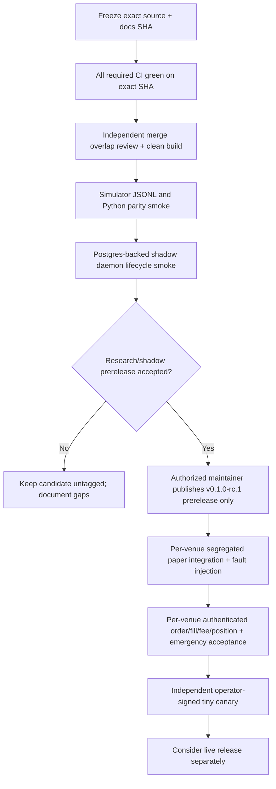

# Project status — post-merge source audit (2026-09-22)

**Stage: P0 integrated research, simulation and real-venue runtime hardening.** This is neither a released product nor an accepted unattended-trading system. Initial research/shadow prerelease is a *candidate*, gated by exact-commit CI and clean-machine runtime smoke. **Live/unattended release: NO-GO.** See [RELEASE_READINESS](RELEASE_READINESS.md) for version plan and evidence.

## Truthful completion table

| Component | Implemented or merged | Not proven / incomplete |
| --- | --- | --- |
| Python research | Factors/ML/tuning, batch environment, causal replay, versioned signal and optional Jev challenger | Reproducible profitable HFT edge, actual fill/fee/latency calibration |
| Rust simulation | `pg-sim` JSONL worker + Python client, deterministic matching and advanced research order semantics | Real-venue advanced-order parity and full simulator semantic parity across PR #8/#9/#10 overlaps |
| Portable strategy | Market-event features, venue+asset instances, policy graph/legacy automation, derived subscriptions | Live return/average-entry/peak-return features are currently missing from real `position_view` |
| Durable dispatch | Fenced lease, intent before POST, OMS record and journal, stable client IDs | External exactly-once/exposure safety under full real exchange crash/failover matrix |
| Hyperliquid | SDK feed and real execution adapter constructed in `paper/live`; `cloid` recovery | Isolated real authenticated full lifecycle, fees, restart, emergency completion |
| IBKR | TWS feed and real execution adapter constructed in `paper/live`; `order_ref` and execution-history recovery | Code-level proof paper account cannot be live; software reduce-only race/fault acceptance |
| Binance Portfolio Margin | PM parsers/private stream/signed history, isolated diagnostics, order-level immutable fill/OMS settlement primitives | **No runtime feed or real adapter registration**; missing account-wide cursor/position/fill integration |
| Runtime | `main.rs` dispatches shadow -> `daemon`, paper/live -> `live_daemon`; real daemon performs initial and periodic recover/reconcile and entry guarding | Neither paper nor live have an accepted per-venue operator release; paper can have external side effects |
| PostgreSQL | Journal, lease/fencing, orders, ownership/reconcile reports; isolated ledger integration tests | Cross-venue authenticated and full account-wide atomic settlement/restart evidence |
| HTTP/observability | Wired `/healthz`, `/readyz`, `/metrics`, `/admin/reload`; separate `pg-observability` crate implements snapshot/events API | **Snapshot/events not wired into pg-core**; reload handler has no auth; only protect via network controls until fixed |
| Telegram/control | `pg-control` contract/feature builds, control-plane spec | Real daemon's `/emergency_exit` end-to-end audited reduce-only/HALT flow unproven |
| Deployment | Pinned Rust 1.98.1, committed Cargo.lock, Compose configuration checks, Docker image template | Clean Docker image build/run, signed digest, host rollback, independent review and immutable release artifacts |

## Current code execution mode — correction to older documents

The former assertion that `pg-core --serve` rejects paper/live is **obsolete** after merge. In `rust/crates/pg-core/src/main.rs`, `shadow` selects `daemon::serve`, while `paper/live` select `live_daemon::serve`. `build_real_adapter_registry` builds Hyperliquid and IBKR real execution adapters but explicitly errors for Binance PM; no fallback to simulated execution exists for real modes. `PG_RUN_MODE=live` requires `PG_LIVE_TRADING=true` plus runtime and operator gates, but the presence of the code path must **not** be interpreted as real-money acceptance. Paper's real adapters require independently verified destination-account isolation.

### Important post-merge discrepancies

1. PR #10 merged two divergent legacy histories using `-X ours` for overlapping hunks; independently check simulator parity and observability integration, not just branch ancestry.
2. `pg-observability` is included in workspace `Cargo.toml`, but **not** in `pg-core/Cargo.toml`; the current `health.rs` router does not serve `/v1/snapshot` or `/v1/events`.
3. `live_daemon::position_view(quantity)` supplies a quantity but no average entry, fill count or unrealized/peak return; return-dependent policy exits must be held pending feature completeness.
4. IBKR real adapter is constructed in paper without a proven paper-account assertion in the adapter builder; Compose default `TRADING_MODE=paper`, `READ_ONLY_API=yes` is not a robust guard against overrides/external gateways.
5. `health.rs` has an unauthenticated `POST /admin/reload`, defaults to bind `0.0.0.0:8080`. Production Compose maps its host port to `127.0.0.1`, but direct deployments must protect the endpoint.
6. Binance PM history probe and order-level settlement components do not constitute complete daemon account-wide cursor/position/fee reconciliation. Existing Binance PM/Freqtrade deployment remains entirely separate.

## CI observations and their limits

On pre-audit commit `293ba6296e7af47982b3df7c8b253cfe7c3ab3df`, [GitHub CI run 35719111159](https://github.com/xxxxxwater/pg-tsy-core-bootstrap/actions/runs/35719111159) showed **7/7 jobs successfully completed** on latest job inspection: Rust workspace fmt/strict Clippy/tests, Hyperliquid/IBKR feature tests and pg-core IBKR build, Binance/Jev contracts, Python Ruff/pytest, lockfile and Compose config. [PostgreSQL run 35719111158](https://github.com/xxxxxwater/pg-tsy-core-bootstrap/actions/runs/35719111158) showed its fenced-ledger job successful. These are actual GitHub Actions results on that **specific source SHA**. They do not validate documentation commits made afterward or authenticate any exchange or start Docker containers. Recheck the **final** commit and every required job before tagging.

## Immediate acceptance sequence

A healthy status endpoint, green unit CI, Jev probability output or PM read-only probe cannot substitute for an acceptance gate. Do not enable real routing or clear `SAFE_HOLD` automatically, and do not modify incumbent Binance PM/Freqtrade or manually owned positions. For the detailed backlog and deployment boundaries see [ROADMAP](ROADMAP.md), [PRODUCTION_RUNTIME](PRODUCTION_RUNTIME.md), [EXCHANGES](EXCHANGES.md) and [ARCHITECTURE](ARCHITECTURE.md).
