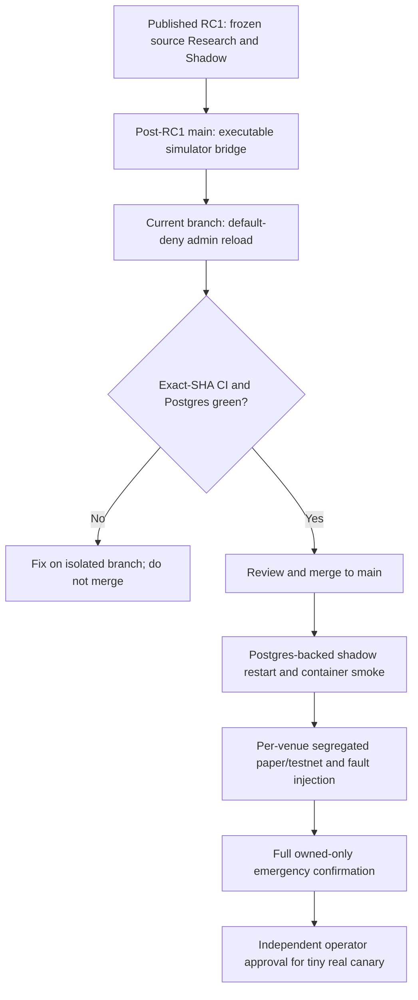

# PG-TSY project status — 2026-09-22

**Published:** [`v0.1.0-rc.1`](https://github.com/xxxxxwater/pg-tsy-core-bootstrap/releases/tag/v0.1.0-rc.1) is an immutable-in-practice, source-only Research/Shadow prerelease pointing at `ce7defe22c6b385aa0b1da14f7f45611ae60e136`. This is not a stable 1.0, production image, deployed service or live-trading authorization. Later `main` changes are not part of RC1. **Unattended/live: NO-GO.** See [release readiness](RELEASE_READINESS.md).

## Current implementation versus actual acceptance

| Plane | Source and verified changes | Missing proof / restriction |
| --- | --- | --- |
| Research + offline simulator | Python research, causal replay and Jev advisory; post-RC1 `pg-sim` has a real JSONL executable and non-skipped Python subprocess contract, enforced by `pg-sim-bridge` CI | Simulator order semantics do not establish real exchange support, execution latency or profitability; historical PR #8/#9/#10 overlap still needs an independent semantic review |
| Strategies | Normalized features, registry, policy graph, legacy automation and derived subscriptions | Real `position_view` lacks average-entry/unrealized/peak returns and filled-entry count; dependent live exits cannot be claimed operational |
| Risk/OMS/durable state | Journal-before-dispatch, stable IDs, Postgres lease/fencing, settlement, reconcile and sticky gates; isolated DB integration CI | Authenticated exchange-wide fills, fees, ownership, recovery, crash/failover and no-duplicate-exposure acceptance incomplete |
| Hyperliquid | Market feed, SDK adapter and `cloid` recovery; `paper/live` builds real adapter | Segregated testnet account observed lifecycle, fees, kill-9, restart and emergency completion not accepted |
| IBKR | Opt-in TWS feed, real adapter, `order_ref`/execution recovery | Must fail-close on unverified paper account identity; software-only stock reduce-only race/emergency proof absent |
| Binance Portfolio Margin | Isolated signed history, parsing, private stream and order-level settlement primitives | **No real daemon feed or execution/recovery adapter registered**; needs complete PM risk and account-wide truth/cursor integration |
| Shadow and runtime | `main.rs` routes shadow to simulated daemon and paper/live to real daemon; no shadow fallback; real daemon performs initial/periodic reconcile | Full Postgres-backed shadow restart smoke and per-venue external acceptance remain separate gates; `paper` can send real external orders |
| Monitoring | `/healthz`, `/readyz`, `/metrics`; `pg-observability` is a separate library | `/v1/snapshot` and `/v1/events` still not wired into `pg-core`; keep health listener on trusted network |
| HTTP admin | Post-RC1 hardening introduces 32–512-character `PG_ADMIN_TOKEN` and default-deny Bearer authorization for `POST /admin/reload`; tests prove no command for missing/invalid auth | Supplied Compose does not inject secret by default; remote management still needs isolated network, secret management, audit and TLS; see [admin security](ADMIN_RELOAD_SECURITY.md) |
| Telegram | Control command contracts compile behind feature | Authenticated start/emergency exit and owned-only flatten **not accepted end to end** |
| Delivery | Pinned Rust toolchain, lockfile, main CI and DB CI; published source RC1 | No production Docker image digest, verified server deployment, per-venue operator signoff or stable release |

## Evidence, tied to the correct commit

- Pre-audit baseline `293ba629`: [seven-job CI](https://github.com/xxxxxwater/pg-tsy-core-bootstrap/actions/runs/35719111159) and [isolated PostgreSQL](https://github.com/xxxxxwater/pg-tsy-core-bootstrap/actions/runs/35719111158) succeeded. This does **not** prove later commits.
- Post-simulator `main` commit `726a28c`: [CI](https://github.com/xxxxxwater/pg-tsy-core-bootstrap/actions/runs/35724440246) and [PostgreSQL](https://github.com/xxxxxwater/pg-tsy-core-bootstrap/actions/runs/35724440120) both completed successfully; see also [simulator bridge](https://github.com/xxxxxwater/pg-tsy-core-bootstrap/actions/runs/35724050942) for the earlier integration candidate. These remain offline/source CI, not exchange acceptance.
- The **current administrative hardening branch must be verified on its final exact SHA** before merge. The first implementation attempt `e0194cb` failed `cargo fmt --check`; formatting was corrected in a subsequent commit. Do not cite a green ancestor as proof of a later SHA.

## Runtime truth and release progression

Real `paper/live` adapter construction is **not** a promise of safe real money. Neither green CI nor Jev signals may override risk, lease fencing, ownership, SAFE_HOLD or venue-specific acceptance. The incumbent Binance PM/Freqtrade bot and manually owned positions remain entirely outside this repository's upgrades. Additional references: [architecture](ARCHITECTURE.md), [exchanges](EXCHANGES.md), [control plane](CONTROL_PLANE.md), [roadmap](ROADMAP.md).
