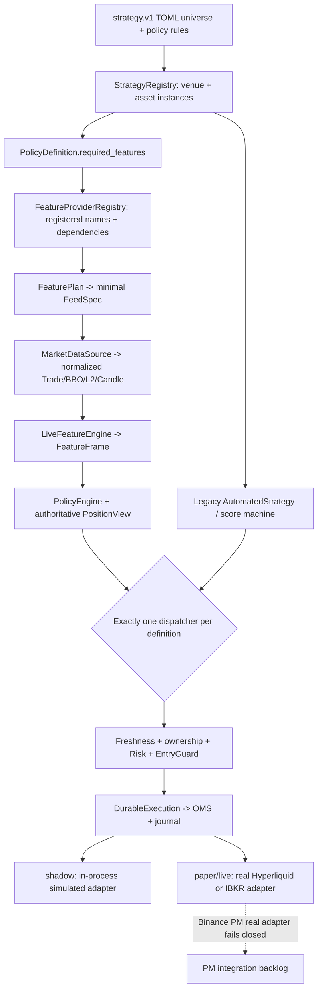

# Portable strategies, feature planning and runtime — verified 2026-09-22

PG-TSY Core separates venue-neutral strategy definitions from market data and execution. A strategy cannot call Binance/Hyperliquid/IBKR SDKs directly: decisions become `OrderIntent`s and pass through Risk -> durable OMS/journal -> the mode-specific execution adapter -> reconciliation. **Source-level code exists for paper/live; that is not paper-account or live-trading acceptance.** See [ARCHITECTURE](ARCHITECTURE.md), [EXCHANGES](EXCHANGES.md) and [RELEASE_READINESS](RELEASE_READINESS.md).

## 1. Portable cross-venue design



A valid portable definition may declare e.g. `BINANCE_PM:ETHUSDT`, `HYPERLIQUID:HYPE`, `IBKR:AAPL`; each expands into a separate venue/asset instance with independent factors, signal sequence, strategy phase, ownership and working intent. **A syntactically valid Binance PM instance currently cannot start live-market subscriptions** because the daemon lacks a PM runtime feed; the real adapter builder also rejects the venue.

## 2. Definitions and independent identities

Definitions live under `strategies/*.toml` (or `PG_STRATEGY_DIR`). A legacy single-venue universe remains supported:

```toml
[universe]
venue = "HYPERLIQUID"
assets = ["HYPE", "SOL"]
```

A multi-venue universe uses independent instruments:

```toml
[universe]
[[universe.instruments]]
venue = "BINANCE_PM"
asset = "ETHUSDT"
[[universe.instruments]]
venue = "HYPERLIQUID"
asset = "HYPE"
[[universe.instruments]]
venue = "IBKR"
asset = "AAPL"
```

Instance identities include both venue and asset, e.g. `portable-momentum:HYPERLIQUID:HYPE` to prevent collisions. An instrument can be modeled while still failing executable venue-capability validation; the configuration format is **not** proof that all three adapters can trade.

## 3. Rule graph, features and execution ownership

Portable policy uses named `FeatureFrame`, `StrategyContext` (`AssetKey`, features, `PositionView`, time), filters, entry/exit rules and explicit sizing. An illustrative rule:

```toml
[[policy.filters]]
id = "liquidity"
mode = "all"
[[policy.filters.predicates]]
feature = "spread_bps"
op = "lte"
value = 20.0

[[policy.entries]]
id = "momentum_long"
side = "Buy"
mode = "all"
[[policy.entries.predicates]]
feature = "momentum_bps"
op = "gte"
value = 20.0

[[policy.exits]]
id = "loss_exit"
mode = "any"
[[policy.exits.predicates]]
feature = "position.unrealized_return"
op = "lte"
value = -0.10
```

**Caution:** this exit example is suitable for fixture/shadow testing but is **not accepted as a live exit policy**. `live_daemon::position_view(quantity)` currently sets average entry, unrealized/peak return to `None` and fill count to zero; it does not calculate those from authoritative executions/mark prices. Missing features fail predicate evaluation and are reported, but a missed loss-exit is not equivalent to safe position management. Wire and test venue-truth fills, entry price, market marks and return/peak fields or reject these live strategies at load/startup before any capital is used.

A definition with at least one compiled policy entry/exit graph is **policy-driven**; its legacy `[automation]` `Submit` is suppressed. A definition with only `[automation]` retains the legacy score path. This prevents two engines from submitting twice for one definition. Entries are from flat and risk-checked; short exposure requires explicit `[strategy] allow_short=true` (default `false`). Policy exits are `ReduceOnly` at the common contract but IBKR ordinary stock execution provides only an explicit software guard, not a venue-native atomic guarantee.

## 4. Feature plan and data resolution

| Feature group | Required normalized feed |
| --- | --- |
| `last_price`, `vwap`, `vwap_deviation_bps`, `trade_imbalance` | Trades |
| `spread_bps` | BestBidAsk |
| `book_imbalance` | L2Book |
| `momentum_bps`, `realized_volatility_bps`, `volume_ratio` | Candle |
| `warmup_ratio`, `score`, `confidence` | Trades + BBO + L2 + Candle |
| Position fields | PositionView; **must be populated from the active runtime's actual state** |

`required_features()` -> registry -> minimal `FeedSpec` -> normalized `MarketEvent` -> `LiveFeatureEngine` -> `FeatureFrame` -> policy. Unregistered named features fail at strategy load. Missing runtime values cannot make a predicate match. An explicit unsupported candle interval fails validation; the venue default is Hyperliquid one-minute and IBKR five-second according to current capability documentation. IBKR tick data does not expose a trustworthy monotonic exchange sequence; use freshness/resync and leave `sequence=None` rather than inventing gap evidence.

## 5. Mode-specific order and position behavior

| Mode | Feed/execution | Position data | Important restriction |
| --- | --- | --- | --- |
| `shadow` | Real Hyperliquid/IBKR market feeds can drive the in-process `ShadowExecutionAdapter`; `rest` or `immediate` fill | Simulated quantity, average entry, filled entries, unrealized/peak returns from shadow venue | No exchange order requests; Binance PM market feed unavailable; complete fill-to-durable-OMS/restart proof still needed |
| `paper` | `live_daemon` constructs **real** Hyperliquid/IBKR execution adapters | Real daemon's quantity-only `PositionView`, incomplete return fields | **External order requests can happen.** Hyperliquid requires Testnet; IBKR paper-account enforcement must be independently proved before use |
| `live` | `live_daemon` constructs real adapters with explicit live key/startup/operator gates | Same real-position feature limitation until corrected | Per-venue authentic account/fee/fill/emergency acceptance absent; no unattended approval |

`PG_RUN_MODE=paper` plus `PG_LIVE_TRADING=false` is not an offline simulated order executor. The venue credentials, account and Gateway configuration determine where external side effects land. `RunConfig::routes_to_real_venue()` returning false for paper is not an exchange-level protection. A private Binance PM diagnostic is not a strategy deployment prerequisite for Hyperliquid/IBKR; see the dedicated PM runbook for its own boundaries.

## 6. Simulation, fixture replay and migration

`pg-sim` supplies a Rust deterministic matching/advanced-order research kernel through a persistent JSONL worker; Python batch/research environments may use `RustSimClient` for repeated test steps. IOC/FOK/GTC/GTD/DAY, auction, post-only, iceberg and composite OCO/OTO/OUO research semantics **are not automatically mapped to live venue order types**. Calibrate latency, queue position and fees against actual captures before claiming HFT execution accuracy.

Portable policy feature-fixture replay and live-style normalized market-event replay share feature names/units. Validation/replay only; no venue orders:

```bash
# from repository root
make strategy-validate
make policy-replay FEATURES=data/replay/policy_features.jsonl
make strategy-replay EVENTS=data/replay/hype.jsonl

# equivalent direct fixture run from rust/
PG_INSTANCE_ID=local-policy-replay PG_STRATEGY_DIR=../strategies \
  cargo run -p pg-core -- --replay-policy-features ../data/replay/policy_features.jsonl
```

The fixture output path is `portable_policy_fixture`; normalized market replay is `portable_policy_live`. Compare rule outcomes, units and missing-feature behavior before migrating a strategy. For a Freqtrade migration, map whitelist/informative pairs -> venue+asset universe/timeframes, indicators -> named providers, entry conditions -> filters and `EntryRule`, DCA -> sizing policy, stop/exit -> independently evaluated `ExitRule`/risk policy, persistence -> OMS/ownership/reconcile. The repository's existing Freqtrade production bot remains **untouched**; parity for VWAP_V4 cannot be claimed without rule-level fixtures and execution validation.

## 7. Reload and unattended acceptance

`StrategyRegistry::reload_file` validates before swapping; it refuses a direct replacement with owned positions, active intents, nonflat/entering/exiting or unresolved `SafeHold`/`Unknown` state. `POST /admin/reload` currently queues `ControlCommand::ReloadStrategies`, not a trading order. **`pg-core/src/health.rs` contains no authentication for the endpoint**, defaults to a `0.0.0.0:8080` listener; production Compose host mapping is loopback but standalone deployments must protect it. The live daemon's topology failures stick through subsequent reconciliation until topology validation succeeds.

Before a release claiming unattended strategy parity, prove `risk -> durable intent -> venue order -> exchange fills/fees -> OMS/position reconciliation -> restart -> safe resume`, unknown-ACK/lookup, stale feed, partial fill, cancel race, database/fencing loss, manual ownership and separately authorized owned-only emergency flatten on **each** venue. Source compilation or a backtest cannot substitute. Consult [release readiness](RELEASE_READINESS.md) for research/shadow release gates and separately approved paper/live progression.
